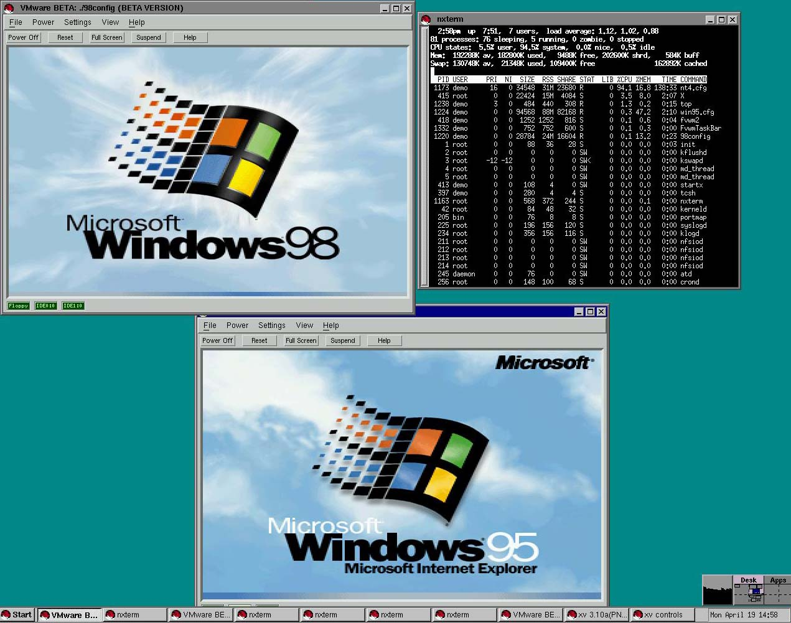

# Introduction

## Who am I?

_A portrait of the author in the form he will assume over the course of this project, having returned to our time to warn his present self against pursuing this course of action._

My name is Nathan Douglas. The best source of information about my electronic life is probably [my GitHub profile](https://github.com/ndouglas). It almost certainly would _not_ be [my LinkedIn profile](https://linkedin.com/in/nug-doug/). I also have a blog about non-computer-related stuff [here](https://darkdell.net/).

## What Do I Do?

_The author in his eventual form advising the author in his present form not to do the thing, and why._

I've been trying to get computers to do what I want, with mixed success, since the early mid-nineties. I earned my Bachelor's in Computer Science from the University of Nevada at Las Vegas in 2011, and I've been working as a software/DevOps engineer ever since, depending on gig.

I consider myself a DevOps Engineer. I consider DevOps a methodology _and_ a role, in that I try to work in whatever capacity I can to improve the product delivery lifecycle and shorten delivery lead time. I generally do the work that is referred to as "DevOps" or "platform engineering" or "site reliability engineering", but I try to emphasize the theoretical aspects, e.g. Lean Management, sytems thinking, etc. That's not to say that I'm an expert, but just that I try to keep the technical details grounded in the philosophical justifications, the big picture.

## Background

_"What would you do if you had an AMD K6-2 333MHz and 96MB RAM?"_
_"I'd run **two** copies of Windows 98, my dude."_

At some point in the very early 00's, I believe, I first encountered VMWare and the idea that I could run a computer inside of another computer. That wasn't the first time I'd encountered a virtual machine -- I'd played with Java in the '90's, and played _Zork_ and other Infocom and Inform games -- but it might've been the first time that I really understood the idea.

And I made use of it. For a long time – most of my twenties – I was occupied by a writing project. I maintained a virtual machine that ran a LAMP server and hosted various content management systems and related technologies: raw HTML pages, MediaWiki, DokuWiki, Drupal, etc, all to organize my thoughts on this and other projects. Along the way, I learned a whole lot about this sort of deployment: namely, that it was a pain in the ass.

I finally abandoned that writing project around the time Docker came out. I immediately understood what it was: a less tedious VM. (Admittedly, my understanding was not that sophisticated.) I built a decent set of skills with Docker and used it wherever I could. I thought Docker was about as good as it got.

At some point around 2016 or 2017, I became aware of Kubernetes. I immediately built a 4-node cluster with old PCs, doing a version of [Kubernetes the Hard Way](https://github.com/kelseyhightower/kubernetes-the-hard-way) on bare metal, and then shifted to a custom system with four VMWare VMs that PXE booted, setup a CoreOS configuration with Ignition and what was then called Matchbox, and formed into a self-healing cluster with some neat toys like [GlusterFS](https://www.gluster.org), etc. Eventually, though, I started neglecting the cluster and tore it down.

Around 2021, my teammates and I started considering a Kubernetes-based infrastructure for our applications, so I got back into it. I set up a rather complicated infrastructure on a three-node [Proxmox VE](https://www.proxmox.com/en/proxmox-virtual-environment/overview) cluster that would create three three-node Kubernetes clusters using [LXC](https://linuxcontainers.org) containers. From there I explored [ArgoCD](https://argoproj.github.io/cd/) and GitOps and Helm and some other things that I hadn't really played with before. But again, my interest waned and the cluster didn't actually get much action.

A large part of this, I think, is that I didn't trust it to run high-FAF (Family Acceptance Factor) apps, like Plex, etc. After all, this was supposed to be a cluster I could tinker with, and tear down and destroy and rebuild at any time with a moment's notice. So in practice, this ended up being a toy cluster.

And while I'd gone through Kubernetes the Hard Way (twice!), I got the irritating feeling that I hadn't really learned all that much. I'd done _Linux From Scratch_, and had run Gentoo for several years, so I was no stranger to the idea of following a painfully manual process filled with shell commands and waiting for days for my computer to be useful again. And I did learn a lot from all three projects, but, for whatever reason, it didn't stick all that well.

## Motivation

In late 2023, my team's contract concluded, and there was a possibility I might be laid off. My employer quickly offered me a position on another team, which I happily and gratefully accepted, but I had already applied to several other positions. I had some promising paths forward, but... not as many as I would like. It was an unnerving experience.

Not everyone is using Kubernetes, of course, but it's an increasingly essential skill in my field. There are other skills I have – Ansible, Terraform, Linux system administration, etc – but I'm not entirely comfortable with my knowledge of Kubernetes, so I'd like to deepen and broaden that as effectively as possible.

## Goals

I want to get really good at Kubernetes. Not just administering it, but having a good understanding of what is going on under the hood at any point, and how best to inspect and troubleshoot and repair a cluster.

I want to have a fertile playground for experimenting; something that is not used for other purposes, not expected to be stable, ideally not even accessed by anyone else. Something I can do the DevOps equivalent of destroy with an axe, without consequences.

I want to document everything I've learned _exhaustively_. I don't want to take a command for granted, or copy and paste, or even copying and pasting after nodding thoughtfully at a wall of text. I want to embed things deeply into my thiccc skull.

Generally, I want to be _beyond_ prepared for my [CKA](https://www.cncf.io/training/certification/cka/), [CKAD](https://www.cncf.io/training/certification/ckad/), and [CKS](https://www.cncf.io/training/certification/cks/) certification exams. I hate test anxiety. I hate feeling like there are gaps in my knowledge. I want to go in confident, and I want my employers and teammates to be confident of my abilities.

## Approach

This is largely going to consist of me reading documentation and banging my head against the wall. I'll provide links to the relevant information, and type out the commands, but I also want to _persist_ this in Infrastructure-as-Code. Consequently, I'll link to Ansible tasks/roles/playbooks for each task as well.
