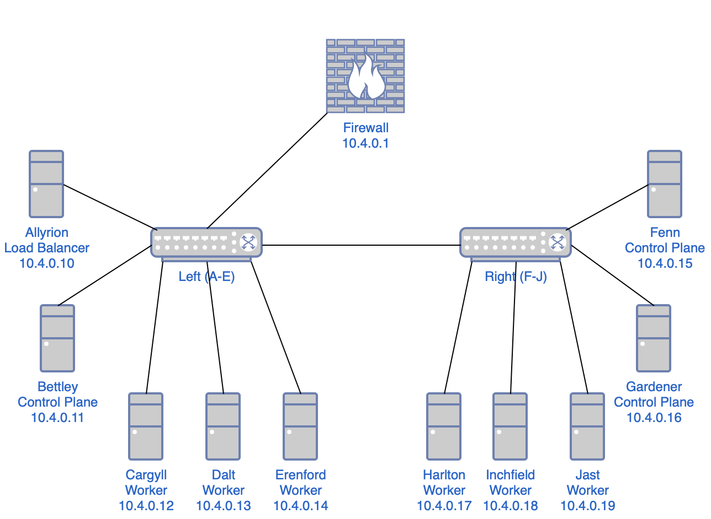

# Cluster Roles and Responsibilities

Observations:
- The cluster has a single power supply but two power distribution units (PDUs) and two network switches, so it seems reasonable to segment the cluster into left and right halves.
- I want high availability, which requires a control plane capable of a quorum, so a minimum of three nodes in the control plane.
- I want to use a dedicated external load balancer for the control plane rather than configure my existing Opnsense firewall/router. (I'll have to do that to enable MetalLB via BGP, sadly.)
- So that would yield one load balancer, three control plane nodes, and six worker nodes.
- With the left-right segmentation, I can locate one load balancer and one control plane node on the left side, two control plane nodes on the right side, and three worker nodes on each side.

This isn't _really_ high-availability; the cluster has multiple single points of failure:
- the load balancer node
- whichever network switch is connected to the upstream
- the power supply
- the PDU powering the LB
- the PDU powering the upstream switch
- etc.

That said, I find those acceptable given the nature of this project.

## Load Balancer

**Allyrion**, the first node alphabetically and the top node on the left side, will run a load balancer. I had a number of options here, but I ended up going with [HAProxy](http://www.haproxy.org). HAProxy was my introduction to load balancing, reverse proxying, and so forth, and I have kind of a soft spot for it.

I'd also considered Traefik, which I use elsewhere in my homelab, but I believe I'll use it as an ingress controller. Similarly, I think I prefer to use Nginx on a per-application level. I'm pursuing this project first and foremost to learn and to document my learning, and I'd prefer to cover as much ground as possible, and as clearly as possible, and I believe I can do this best if I don't have to worry about having to specify _which_ installation of `$proxy` I'm referring to at any given time.

So:
- **HAProxy**: Load balancer
- **Traefik**: Ingress controller
- **Nginx**: Miscellaneous

## Control Plane

**Bettley** (the second node on the left side), **Gardener**, and **Harlton** (the first and second nodes on the right side) will be the control plane nodes.

It's common, in small home Kubernetes clusters, to remove the control plane taint (`node-role.kubernetes.io/control-plane`) to allow miscellaneous pods to be scheduled on the control plane nodes. I won't be doing that here; six worker nodes should be sufficient for my purposes, and I'll try (where possible and practical) to follow best practices. That said, I might find some random fun things to run on my control plane nodes, and I'll adjust their tolerations accordingly.

## Workers

The remaining nodes (**Cargyll**, **Dalt**, and **Erenford** on the left, and **Harlton**, **Inchfield**, and **Jast** on the right) are dedicated workers. What sort of workloads will they run?

Well, probably nothing interesting. Not Plex, not torrent clients or *darrs. Mostly logging, metrics, and similar. I'll probably end up gathering a lot of data about data. And that's fine – these Raspberry Pis are running off SD cards; I don't really want them to be doing anything interesting _anyway_.

## Network Topology

In case you don't quite have a picture of the infrastructure so far, it should look like this:

## Frequently Asked Questions

### Why didn't you make Etcd high-availability?

It seems like I'd need that cluster to have a quorum too, so we're talking about three nodes for the control plane, three nodes for Etcd, one for the load balancer, and, uh, three worker nodes. That's a bit more than I'd like to invest, and I'd like to avoid doubling up anywhere (although I'll probably add additional functionality to the load balancer). I'm interested in the etcd side of things, but not really enough to compromise elsewhere. I could be missing something obvious, though; if so, please let me know.

### Why didn't you just do A=load balancer, B-D=control plane, and E-J=workers?

I could've and should've and still might. But because I'm a bit of a fool and wasn't really paying attention, I put A-E on the left and F-J on the right, rather than A,C,E,G,I on the left and B,D,F,H,J on the right, which would've been a bit cleaner. As it is, I need to think a second about which nodes are control nodes, since they aren't in a strict alphabetical order.

I might adjust this in the future; it should be easy to do so, after all, I just don't particularly want to take the cluster apart and rebuild it, especially since the standoffs were kind of messy as a consequence of the heatsinks.
