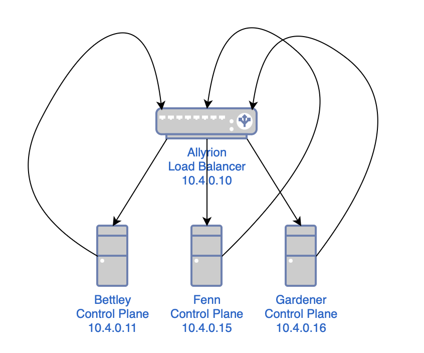
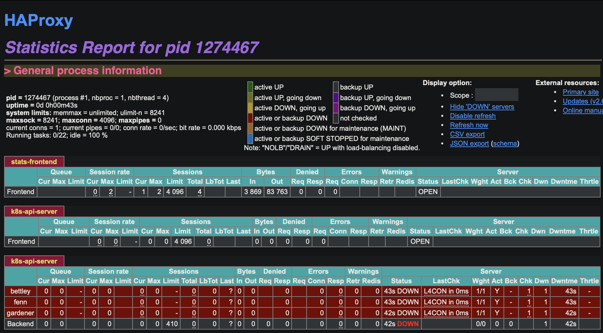

# Load Balancer

This cluster should have a high-availability control plane, and we can start laying the groundwork for that immediately.

This might sound complex, but all we're doing is:

- creating a load balancer
- configuring the load balancer to use all of the control plane nodes as a list of backends
- telling anything that sends requests to a control plane node to send them to the load balancer instead



As mentioned before, we're using HAProxy as a load balancer. First, though, I'll install `rsyslog`, a log processing system. It will gather logs from HAProxy and deposit them in a more ergonomic location.

```bash
$ sudo apt install -y rsyslog
```

At least at the time of writing (February 2024), `rsyslog` on Raspberry Pi OS includes a bit of configuration that relocates HAProxy logs:

```
# /etc/rsyslog.d/49-haproxy.conf

# Create an additional socket in haproxy's chroot in order to allow logging via
# /dev/log to chroot'ed HAProxy processes
$AddUnixListenSocket /var/lib/haproxy/dev/log

# Send HAProxy messages to a dedicated logfile
:programname, startswith, "haproxy" {
  /var/log/haproxy.log
  stop
}
```

In Raspberry Pi OS, installing and configuring HAProxy is a simple matter.

```bash
$ sudo apt install -y haproxy
```

Here is the configuration I'm working with for HAProxy at the time of writing (February 2024); I've done my best to comment it thoroughly. You can also see the [Jinja2 template](https://github.com/goldentooth/cluster/blob/main/roles/goldentooth.setup_load_balancer/templates/haproxy.cfg.j2) and the [role](https://github.com/goldentooth/cluster/blob/main/roles/goldentooth.setup_load_balancer/tasks/main.yaml) that deploys the template to configure HAProxy.

```
# /etc/haproxy/haproxy.cfg

# This is the HAProxy configuration file for the load balancer in my Kubernetes
# cluster. It is used to load balance the API server traffic between the
# control plane nodes.

# Global parameters
global
  # Sets uid for haproxy process.
  user haproxy
  # Sets gid for haproxy process.
  group haproxy
  # Sets the maximum per-process number of concurrent connections.
  maxconn 4096
  # Configure logging.
  log /dev/log local0
  log /dev/log local1 notice

# Default parameters
defaults
  # Use global log configuration.
  log global

# Frontend configuration for the HAProxy stats page.
frontend stats-frontend
  # Listen on all IPv4 addresses on port 8404.
  bind *:8404
  # Use HTTP mode.
  mode http
  # Enable the stats page.
  stats enable
  # Set the URI to access the stats page.
  stats uri /stats
  # Set the refresh rate of the stats page.
  stats refresh 10s
  # Set the realm to access the stats page.
  stats realm HAProxy\ Statistics
  # Set the username and password to access the stats page.
  stats auth nathan:<redacted>
  # Hide HAProxy version to improve security.
  stats hide-version

# Kubernetes API server frontend configuration.
frontend k8s-api-server
  # Listen on the IPv4 address of the load balancer on port 6443.
  bind 10.4.0.10:6443
  # Use TCP mode, which means that the connection will be passed to the server
  # without TLS termination, etc.
  mode tcp
  # Enable logging of the client's IP address and port.
  option tcplog
  # Use the Kubernetes API server backend.
  default_backend k8s-api-server

# Kubernetes API server backend configuration.
backend k8s-api-server
  # Use TCP mode, not HTTPS.
  mode tcp
  # Sets the maximum time to wait for a connection attempt to a server to
  # succeed.
  timeout connect 10s
  # Sets the maximum inactivity time on the client side. I might reduce this at
  # some point.
  timeout client 86400s
  # Sets the maximum inactivity time on the server side. I might reduce this at
  # some point.
  timeout server 86400s
  # Sets the load balancing algorithm.
  # `roundrobin` means that each server is used in turns, according to their
  # weights.
  balance roundrobin
  # Enable health checks.
  option tcp-check
  # For each control plane node, add a server line with the node's hostname and
  # IP address.
  # The `check` parameter enables health checks.
  # The `fall` parameter sets the number of consecutive health check failures
  # after which the server is considered to be down.
  # The `rise` parameter sets the number of consecutive health check successes
  # after which the server is considered to be up.
  server bettley 10.4.0.11:6443 check fall 3 rise 2
  server fenn 10.4.0.15:6443 check fall 3 rise 2
  server gardener 10.4.0.16:6443 check fall 3 rise 2
  ```

This enables the HAProxy stats frontend, which allows us to gain some insight into the operation of the frontend in something like realtime.



We see that our backends are unavailable, which is of course expected at this time. We can also read the logs, in `/var/log/haproxy.log`:

```bash
$ cat /var/log/haproxy.log
```

```
2024-02-21T07:03:16.603651-05:00 allyrion haproxy[1305383]: [NOTICE]   (1305383) : haproxy version is 2.6.12-1+deb12u1
2024-02-21T07:03:16.603906-05:00 allyrion haproxy[1305383]: [NOTICE]   (1305383) : path to executable is /usr/sbin/haproxy
2024-02-21T07:03:16.604085-05:00 allyrion haproxy[1305383]: [WARNING]  (1305383) : Exiting Master process...
2024-02-21T07:03:16.607180-05:00 allyrion haproxy[1305383]: [ALERT]    (1305383) : Current worker (1305385) exited with code 143 (Terminated)
2024-02-21T07:03:16.607558-05:00 allyrion haproxy[1305383]: [WARNING]  (1305383) : All workers exited. Exiting... (0)
2024-02-21T07:03:16.771133-05:00 allyrion haproxy[1305569]: [NOTICE]   (1305569) : New worker (1305572) forked
2024-02-21T07:03:16.772082-05:00 allyrion haproxy[1305569]: [NOTICE]   (1305569) : Loading success.
2024-02-21T07:03:16.775819-05:00 allyrion haproxy[1305572]: [WARNING]  (1305572) : Server k8s-api-server/bettley is DOWN, reason: Layer4 connection problem, info: "Connection refused at initial connection step of tcp-check", check duration: 0ms. 2 active and 0 backup servers left. 0 sessions active, 0 requeued, 0 remaining in queue.
2024-02-21T07:03:16.776309-05:00 allyrion haproxy[1305572]: Server k8s-api-server/bettley is DOWN, reason: Layer4 connection problem, info: "Connection refused at initial connection step of tcp-check", check duration: 0ms. 2 active and 0 backup servers left. 0 sessions active, 0 requeued, 0 remaining in queue.
2024-02-21T07:03:16.776584-05:00 allyrion haproxy[1305572]: Server k8s-api-server/bettley is DOWN, reason: Layer4 connection problem, info: "Connection refused at initial connection step of tcp-check", check duration: 0ms. 2 active and 0 backup servers left. 0 sessions active, 0 requeued, 0 remaining in queue.
2024-02-21T07:03:17.423831-05:00 allyrion haproxy[1305572]: [WARNING]  (1305572) : Server k8s-api-server/fenn is DOWN, reason: Layer4 connection problem, info: "Connection refused at initial connection step of tcp-check", check duration: 0ms. 1 active and 0 backup servers left. 0 sessions active, 0 requeued, 0 remaining in queue.
2024-02-21T07:03:17.424229-05:00 allyrion haproxy[1305572]: Server k8s-api-server/fenn is DOWN, reason: Layer4 connection problem, info: "Connection refused at initial connection step of tcp-check", check duration: 0ms. 1 active and 0 backup servers left. 0 sessions active, 0 requeued, 0 remaining in queue.
2024-02-21T07:03:17.424446-05:00 allyrion haproxy[1305572]: Server k8s-api-server/fenn is DOWN, reason: Layer4 connection problem, info: "Connection refused at initial connection step of tcp-check", check duration: 0ms. 1 active and 0 backup servers left. 0 sessions active, 0 requeued, 0 remaining in queue.
2024-02-21T07:03:17.653803-05:00 allyrion haproxy[1305572]: Connect from 10.0.2.162:53155 to 10.4.0.10:8404 (stats-frontend/HTTP)
2024-02-21T07:03:17.677482-05:00 allyrion haproxy[1305572]: Connect from 10.0.2.162:53156 to 10.4.0.10:8404 (stats-frontend/HTTP)
2024-02-21T07:03:18.114561-05:00 allyrion haproxy[1305572]: [WARNING]  (1305572) : Server k8s-api-server/gardener is DOWN, reason: Layer4 connection problem, info: "Connection refused at initial connection step of tcp-check", check duration: 0ms. 0 active and 0 backup servers left. 0 sessions active, 0 requeued, 0 remaining in queue.
2024-02-21T07:03:18.115141-05:00 allyrion haproxy[1305572]: [ALERT]    (1305572) : backend 'k8s-api-server' has no server available!
2024-02-21T07:03:18.115560-05:00 allyrion haproxy[1305572]: Server k8s-api-server/gardener is DOWN, reason: Layer4 connection problem, info: "Connection refused at initial connection step of tcp-check", check duration: 0ms. 0 active and 0 backup servers left. 0 sessions active, 0 requeued, 0 remaining in queue.
2024-02-21T07:03:18.116133-05:00 allyrion haproxy[1305572]: Server k8s-api-server/gardener is DOWN, reason: Layer4 connection problem, info: "Connection refused at initial connection step of tcp-check", check duration: 0ms. 0 active and 0 backup servers left. 0 sessions active, 0 requeued, 0 remaining in queue.
2024-02-21T07:03:18.117560-05:00 allyrion haproxy[1305572]: backend k8s-api-server has no server available!
2024-02-21T07:03:18.118458-05:00 allyrion haproxy[1305572]: backend k8s-api-server has no server available!
```

This is fine and dandy, and will be addressed in future chapters.
