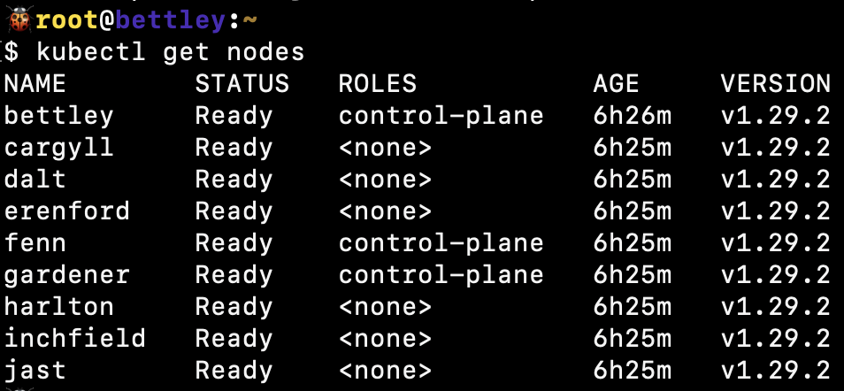
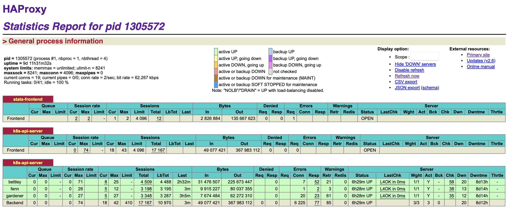

# Admitting the Worker Nodes

Admitting the worker nodes to the cluster is simple; we just have the first control plane node create a token and print the join command (`kubeadm token create --print-join-command`) for each worker node, then execute it from that worker node.

And voilà! We have a functioning cluster.

We can also see that the cluster is functioning well from HAProxy's perspective:

As a reminder, this is all persisted in the [Ansible tasks](https://github.com/goldentooth/cluster/blob/main/roles/goldentooth.bootstrap_k8s/tasks/main.yaml).
