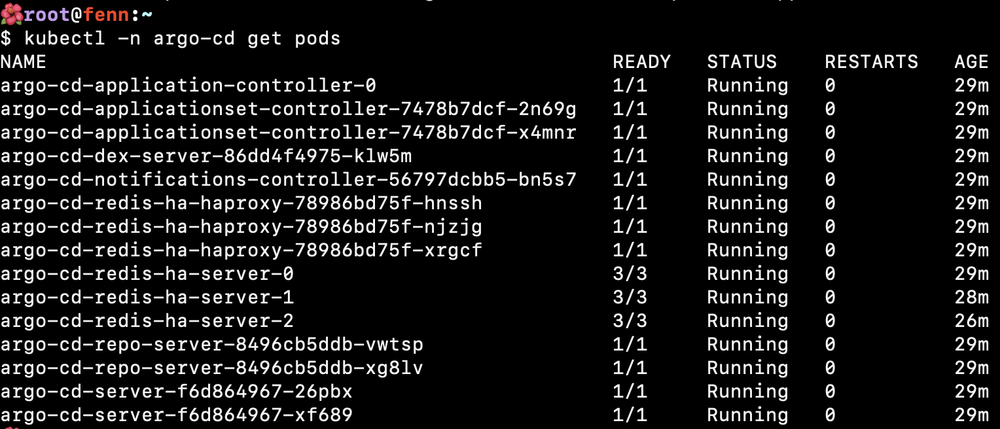
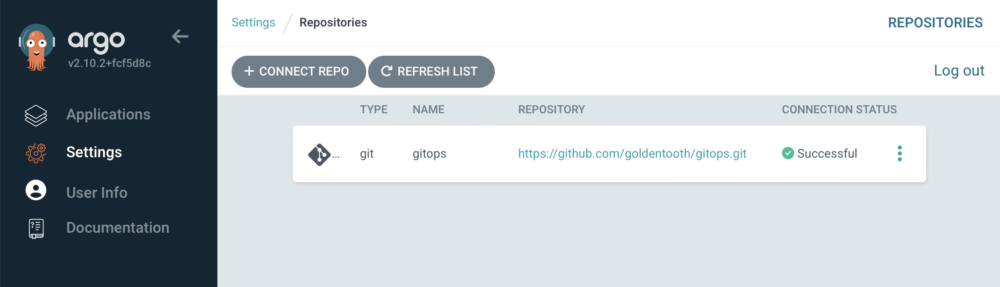

# Installing Argo CD

Argo CD is a large, complicated application in its own right; its Helm chart is thousands of lines long. I'm not trying to learn it all right now, and fortunately, I have a fairly simple structure in mind; build out our applications with an app-of-apps pattern from a public git repository hosted on GitHub. That's about as vanilla as it gets.

I'll install Argo CD via a new Ansible [playbook](https://github.com/goldentooth/cluster/blob/main/playbooks/install_argocd.yaml) and [role](https://github.com/goldentooth/cluster/tree/main/roles/goldentooth.install_argocd).

None of this is particularly complex, but I'll document some of my values overrides here:

```yaml
# I've seen a mix of `argocd` and `argo-cd` scattered around. I preferred
# `argocd`, but I will shift to `argo-cd` where possible to improve
# consistency.
#
# EDIT: The `argocd` CLI tool appears to be broken and does not allow me to
# override the names of certain components when port forwarding.
# See https://github.com/argoproj/argo-cd/issues/16266 for details.
# As a result, I've gone through and reverted my changes to standardize as much
# as possible on `argocd`.
nameOverride: 'argocd'
global:
  # This evaluates to `argocd.goldentooth.hellholt.net`.
  domain: "{{ argocd_domain }}"
  # Add Prometheus scrape annotations to all metrics services. This can
  # be used as an alternative to the ServiceMonitors.
  addPrometheusAnnotations: true
  # Default network policy rules used by all components.
  networkPolicy:
    # Create NetworkPolicy objects for all components; this is currently false
    # but I think I'd like to create these later.
    create: false
    # Default deny all ingress traffic; I want to improve security, so I hope
    # to enable this later.
    defaultDenyIngress: false
configs:
  secret:
    createSecret: true
    # Specify a password. I store an "easy" password, which is in my muscle
    # memory, so I'll use that for right now.
    argocdServerAdminPassword: "{{ vault.easy_password | password_hash('bcrypt') }}"
  # Refer to the repositories that host our applications.
  repositories:
    # This is the main (and likely only) one.
    gitops:
      type: 'git'
      name: 'gitops'
      # This turns out to be https://github.com/goldentooth/gitops.git
      url: "{{ argocd_app_repo_url }}"

redis-ha:
  # Enable Redis high availability.
  enabled: true

controller:
  # The HA configuration keeps this at one, and I don't see a reason to change.
  replicas: 1

server:
  # Enable
  autoscaling:
    enabled: true
    # This immediately scaled up to 3 replicas.
    minReplicas: 2
  # I'll make this more secure _soon_.
  extraArgs:
    - '--insecure'
  # I don't have load balancing set up yet.
  service:
    type: 'ClusterIP'

repoServer:
  autoscaling:
    enabled: true
    minReplicas: 2

applicationSet:
  replicas: 2
```



After running `kubectl -n argocd port-forward service/argocd-server 8081:443 --address 0.0.0.0` on one of my control plane nodes, I'm able to view the web interface, log in, and see that the repository is connectable but that there's nothing interesting in it.



I'll try to improve this situation shortly.
