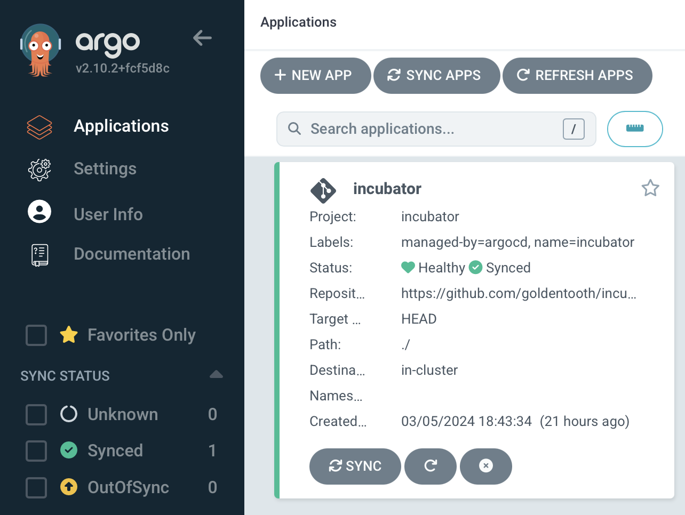

# The "Incubator" GitOps Application

Previously, we discussed GitOps and how Argo CD provides a platform for implementing GitOps for Kubernetes.

As mentioned, the general idea is to have some Git repository somewhere that defines an application. We create a corresponding resource in Argo CD to represent that application, and Argo CD will henceforth watch the repository and make changes to the running application as needed.

What does the repository actually include? Well, it might be a Helm chart, or a kustomization, or raw manifests, etc. Pretty much anything that could be done in Kubernetes.

Of course, setting this up involves some manual work; you need to actually create the application within Argo CD and, if you want it to hang around, you need to presumably commit that resource to some version control system somewhere. We of course want to be careful who has access to that repository, though, and we might not want engineers to have access to Argo CD itself. So suddenly there's a rather uncomfortable amount of work and coupling in all of this.

A common pattern in Argo CD is the "app-of-apps" pattern. This is simply an Argo CD application pointing to a repository that contains other Argo CD applications. Thus you can have a single application created for you by the principal platform engineer, and you can turn it into fifty or a hundred finely grained pieces of infrastructure that said principal engineer doesn't have to know about 🙂

(If they haven't configured the security settings carefully, it can all just be your little secret 😉)

Given that we're operating in a lab environment, we can use the "app-of-apps" approach for the **Incubator**, which is where we can try out new configurations. We can give it fairly unrestricted access while we work on getting things to deploy correctly, and then lock things down as we zero in on a stable configuration.

A (relatively) new construct in Argo CD is the ApplicationSet construct, which seeks to more clearly define how applications are created and fix the problems with the "app-of-apps" approach. That's the approach we will take in this cluster for mature applications.

But meanwhile, we'll create an `AppProject` manifest for the Incubator:

```yaml
---
apiVersion: 'argoproj.io/v1alpha1'
kind: 'AppProject'
metadata:
  name: 'incubator'
  # Argo CD resources need to deploy into the Argo CD namespace.
  namespace: 'argocd'
  finalizers:
    - 'resources-finalizer.argocd.argoproj.io'
spec:
  description: 'GoldenTooth incubator project'
  # Allow manifests to deploy from any Git repository.
  # This is an acceptable security risk because this is a lab environment
  # and I am the only user.
  sourceRepos:
    - '*'
  destinations:
    # Prevent any resources from deploying into the kube-system namespace.
    - namespace: '!kube-system'
      server: '*'
    # Allow resources to deploy into any other namespace.
    - namespace: '*'
      server: '*'
  clusterResourceWhitelist:
    # Allow any cluster resources to deploy.
    - group: '*'
      kind: '*'
```

As mentioned before, this is very permissive. It only slightly differs from the default project by preventing resources from deploying into the `kube-system` namespace.

We'll also create an `Application` manifest:

```yaml
apiVersion: 'argoproj.io/v1alpha1'
kind: 'Application'
metadata:
  name: 'incubator'
  namespace: 'argocd'
  labels:
    name: 'incubator'
    managed-by: 'argocd'
spec:
  project: 'incubator'
  source:
    repoURL: "https://github.com/goldentooth/incubator.git"
    path: './'
    targetRevision: 'HEAD'
  destination:
    server: 'https://kubernetes.default.svc'
  syncPolicy:
    automated:
      prune: true
      selfHeal: true
    syncOptions:
      - Validate=true
      - CreateNamespace=true
      - PrunePropagationPolicy=foreground
      - PruneLast=true
      - RespectIgnoreDifferences=true
      - ApplyOutOfSyncOnly=true
```

That's sufficient to get it to pop up in the Applications view in Argo CD.


