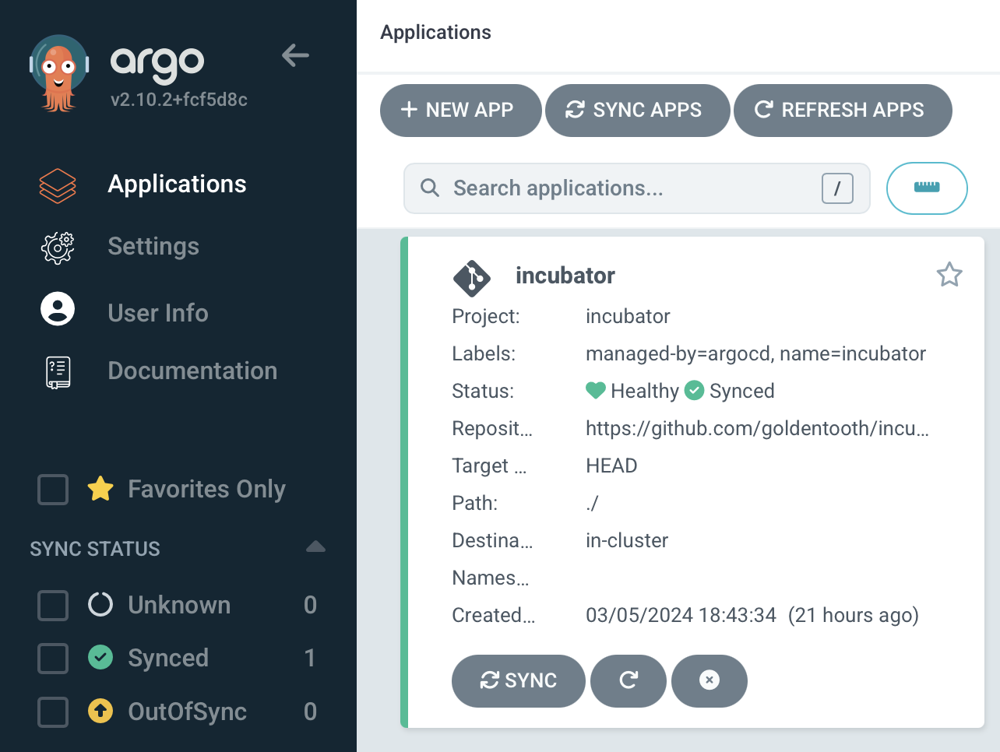

# The "Incubator" GitOps Application

Previously, we discussed GitOps and how Argo CD provides a platform for implementing GitOps for Kubernetes.

As mentioned, the general idea is to have some Git repository somewhere that defines an application. We create a corresponding resource in Argo CD to represent that application, and Argo CD will henceforth watch the repository and make changes to the running application as needed.

What does the repository actually include? Well, it might be a Helm chart, or a kustomization, or raw manifests, etc. Pretty much anything that could be done in Kubernetes.

Of course, setting this up involves some manual work; you need to actually create the application within Argo CD and, if you want it to hang around, you need to presumably commit that resource to some version control system somewhere. We of course want to be careful who has access to that repository, though, and we might not want engineers to have access to Argo CD itself. So suddenly there's a rather uncomfortable amount of work and coupling in all of this.

A common pattern in Argo CD is the "app-of-apps" pattern. This is simply an Argo CD application pointing to a repository that contains other Argo CD applications. Thus you can have a single application created for you by the principal platform engineer, and you can turn it into fifty or a hundred finely grained pieces of infrastructure that said principal engineer doesn't have to know about 🙂

Like any power, this clearly has both potential upsides and potential downsides.

I want to create a Kubernetes cluster that (within reason) follows best practices, and that extends to how we manage GitOps. With Argo CD, we can define an AppProject that specifies particular source repositories from which applications can be deployed (e.g. to restrict them to a single repository, or single organization's repositories), restrict which resources can be deployed, and to which namespaces. There are a number of good security features to choose from. None of them are particularly necessary for my cluster, but I'll end up using them.

But that's not particularly fun during the FAFO stage of cluster development, so I'm going to set up an AppProject with very permissive settings.

```yaml
apiVersion: argoproj.io/v1alpha1
kind: AppProject
metadata:
  name: incubator
  namespace: argocd
  finalizers:
  - resources-finalizer.argocd.argoproj.io
spec:
  clusterResourceWhitelist:
  - group: '*'
    kind: '*'
  description: GoldenTooth incubator project
  destinations:
  - namespace: '!kube-system'
    server: '*'
  - namespace: '*'
    server: '*'
  sourceRepos:
  - '*'
```

This actually more-or-less matches the `default` AppProject that Argo CD automatically installed, with the exception that I don't permit anything to be installed into the `kube-system` namespace. I don't anticipate that being a problem, and it makes me feel mildly more responsible.

This project will allow me to play with various applications in a permissive context and, when I'm reasonably satisfied with the configuration, I can shift it into a different project, application(s), and repository with more restrictive settings.

The AppProject is quite simple:

```yaml
apiVersion: argoproj.io/v1alpha1
kind: AppProject
metadata:
  name: incubator
  # Argo CD resources need to deploy into the Argo CD namespace.
  namespace: argocd
  finalizers:
    - resources-finalizer.argocd.argoproj.io
spec:
  description: GoldenTooth incubator project
  # Allow manifests to deploy from any Git repository.
  # This is an acceptable security risk because this is a lab environment.
  sourceRepos:
    - '*'
  destinations:
    # Prevent any resources from deploying into the kube-system namespace.
    - namespace: '!kube-system'
      server: '*'
    # Allow resources to deploy into any other namespace.
    - namespace: '*'
      server: '*'
  clusterResourceWhitelist:
    # Allow any cluster resources to deploy.
    - group: '*'
      kind: '*'
```

as is the Application:

```yaml
apiVersion: argoproj.io/v1alpha1
kind: Application
metadata:
  name: incubator
  namespace: argocd
  labels:
    name: incubator
    managed-by: argocd
spec:
  project: incubator
  source:
    repoURL: "https://github.com/goldentooth/incubator.git"
    path: './'
    targetRevision: HEAD
  destination:
    server: 'https://kubernetes.default.svc'
  syncPolicy:
    automated:
      prune: true
      selfHeal: true
  syncOptions:
    - Validate=true
    - CreateNamespace=true
    - PrunePropagationPolicy=foreground
    - PruneLast=true
    - RespectIgnoreDifferences=true
    - ApplyOutOfSyncOnly=true
```

Of course, these can be viewed in their Ansible form [here](https://github.com/goldentooth/cluster/blob/main/roles/goldentooth.install_argocd_apps/tasks/projects/incubator.yaml).

The `incubator` repository is very barebones at this point, just four files. The two that matter are:

```yaml
# Chart.yaml
apiVersion: 'v2'
name: 'incubator'
description: 'Incubating Applications'
type: 'application'
version: '0.0.1'
appVersion: '0.0.1'
```

```yaml
# values.yaml
spec:
```

That's sufficient to get us a successfully-syncing application:


