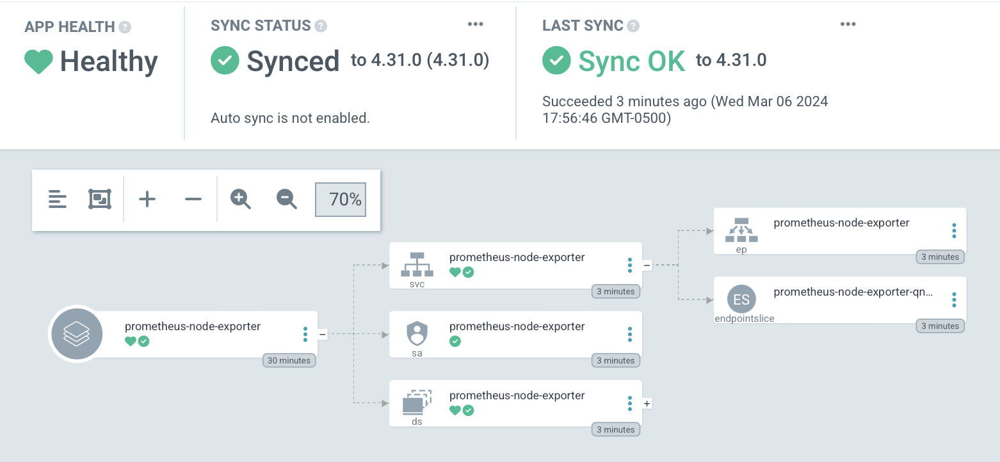

# Prometheus Node Exporter

Sure, I _could_ just jump straight into [kube-prometheus](https://github.com/prometheus-operator/kube-prometheus), but where's the fun (and, more importantly, the _learning_) in that?

I'm going to try to build a system from the ground up, tweaking each component as I go.

[Prometheus Node Exporter](https://prometheus.io/docs/guides/node-exporter/) seems like a reasonable place to begin, as it will give me per-node statistics that I can look at immediately. Or almost immediately.

The first order of business is to modify our `incubator` repository to refer to the [Prometheus Node Exporter Helm chart](https://github.com/prometheus-community/helm-charts/tree/main/charts/prometheus-node-exporter).

By adding the following in the `incubator` repo:

```
# templates/prometheus_node_exporter.yaml
apiVersion: v1
kind: Namespace
metadata:
  name: prometheus-node-exporter
---
apiVersion: argoproj.io/v1alpha1
kind: Application
metadata:
  name: prometheus-node-exporter
  namespace: argocd
  finalizers:
    - resources-finalizer.argocd.argoproj.io
spec:
  destination:
    namespace: prometheus-node-exporter
    server: 'https://kubernetes.default.svc'
  project: incubator
  source:
    repoURL: https://prometheus-community.github.io/helm-charts
    chart: prometheus-node-exporter
    targetRevision: 4.31.0
    helm:
      releaseName: prometheus-node-exporter
```

We'll soon see the resources created:



And we can `curl` a metric butt-ton of information:

```
$ curl localhost:9100/metrics
# HELP go_gc_duration_seconds A summary of the pause duration of garbage collection cycles.
# TYPE go_gc_duration_seconds summary
go_gc_duration_seconds{quantile="0"} 0
go_gc_duration_seconds{quantile="0.25"} 0
go_gc_duration_seconds{quantile="0.5"} 0
go_gc_duration_seconds{quantile="0.75"} 0
go_gc_duration_seconds{quantile="1"} 0
go_gc_duration_seconds_sum 0
go_gc_duration_seconds_count 0
# HELP go_goroutines Number of goroutines that currently exist.
# TYPE go_goroutines gauge
go_goroutines 7
# HELP go_info Information about the Go environment.
# TYPE go_info gauge
go_info{version="go1.21.4"} 1
# HELP go_memstats_alloc_bytes Number of bytes allocated and still in use.
# TYPE go_memstats_alloc_bytes gauge
go_memstats_alloc_bytes 829976
# HELP go_memstats_alloc_bytes_total Total number of bytes allocated, even if freed.
# TYPE go_memstats_alloc_bytes_total counter
go_memstats_alloc_bytes_total 829976
# HELP go_memstats_buck_hash_sys_bytes Number of bytes used by the profiling bucket hash table.
# TYPE go_memstats_buck_hash_sys_bytes gauge
go_memstats_buck_hash_sys_bytes 1.445756e+06
# HELP go_memstats_frees_total Total number of frees.
# TYPE go_memstats_frees_total counter
go_memstats_frees_total 704
# HELP go_memstats_gc_sys_bytes Number of bytes used for garbage collection system metadata.
# TYPE go_memstats_gc_sys_bytes gauge
go_memstats_gc_sys_bytes 2.909376e+06
# HELP go_memstats_heap_alloc_bytes Number of heap bytes allocated and still in use.
# TYPE go_memstats_heap_alloc_bytes gauge
go_memstats_heap_alloc_bytes 829976
# HELP go_memstats_heap_idle_bytes Number of heap bytes waiting to be used.
# TYPE go_memstats_heap_idle_bytes gauge
go_memstats_heap_idle_bytes 1.458176e+06
# HELP go_memstats_heap_inuse_bytes Number of heap bytes that are in use.
# TYPE go_memstats_heap_inuse_bytes gauge
go_memstats_heap_inuse_bytes 2.310144e+06
# HELP go_memstats_heap_objects Number of allocated objects.
# TYPE go_memstats_heap_objects gauge
go_memstats_heap_objects 8628
# HELP go_memstats_heap_released_bytes Number of heap bytes released to OS.
# TYPE go_memstats_heap_released_bytes gauge
go_memstats_heap_released_bytes 1.458176e+06
# HELP go_memstats_heap_sys_bytes Number of heap bytes obtained from system.
# TYPE go_memstats_heap_sys_bytes gauge
go_memstats_heap_sys_bytes 3.76832e+06
# HELP go_memstats_last_gc_time_seconds Number of seconds since 1970 of last garbage collection.
# TYPE go_memstats_last_gc_time_seconds gauge
go_memstats_last_gc_time_seconds 0
# HELP go_memstats_lookups_total Total number of pointer lookups.
# TYPE go_memstats_lookups_total counter
go_memstats_lookups_total 0
# HELP go_memstats_mallocs_total Total number of mallocs.
# TYPE go_memstats_mallocs_total counter
go_memstats_mallocs_total 9332
# HELP go_memstats_mcache_inuse_bytes Number of bytes in use by mcache structures.
# TYPE go_memstats_mcache_inuse_bytes gauge
go_memstats_mcache_inuse_bytes 1200
# HELP go_memstats_mcache_sys_bytes Number of bytes used for mcache structures obtained from system.
# TYPE go_memstats_mcache_sys_bytes gauge
go_memstats_mcache_sys_bytes 15600
# HELP go_memstats_mspan_inuse_bytes Number of bytes in use by mspan structures.
# TYPE go_memstats_mspan_inuse_bytes gauge
go_memstats_mspan_inuse_bytes 37968
# HELP go_memstats_mspan_sys_bytes Number of bytes used for mspan structures obtained from system.
# TYPE go_memstats_mspan_sys_bytes gauge
go_memstats_mspan_sys_bytes 48888
# HELP go_memstats_next_gc_bytes Number of heap bytes when next garbage collection will take place.
# TYPE go_memstats_next_gc_bytes gauge
go_memstats_next_gc_bytes 4.194304e+06
# HELP go_memstats_other_sys_bytes Number of bytes used for other system allocations.
# TYPE go_memstats_other_sys_bytes gauge
go_memstats_other_sys_bytes 795876
# HELP go_memstats_stack_inuse_bytes Number of bytes in use by the stack allocator.
# TYPE go_memstats_stack_inuse_bytes gauge
go_memstats_stack_inuse_bytes 425984
# HELP go_memstats_stack_sys_bytes Number of bytes obtained from system for stack allocator.
# TYPE go_memstats_stack_sys_bytes gauge
go_memstats_stack_sys_bytes 425984
# HELP go_memstats_sys_bytes Number of bytes obtained from system.
# TYPE go_memstats_sys_bytes gauge
go_memstats_sys_bytes 9.4098e+06
# HELP go_threads Number of OS threads created.
# TYPE go_threads gauge
go_threads 6
# HELP node_boot_time_seconds Node boot time, in unixtime.
# TYPE node_boot_time_seconds gauge
node_boot_time_seconds 1.706835386e+09
# HELP node_context_switches_total Total number of context switches.
# TYPE node_context_switches_total counter
node_context_switches_total 1.8612307682e+10
# HELP node_cooling_device_cur_state Current throttle state of the cooling device
# TYPE node_cooling_device_cur_state gauge
node_cooling_device_cur_state{name="0",type="gpio-fan"} 1
# HELP node_cooling_device_max_state Maximum throttle state of the cooling device
# TYPE node_cooling_device_max_state gauge
node_cooling_device_max_state{name="0",type="gpio-fan"} 1
# HELP node_cpu_frequency_max_hertz Maximum CPU thread frequency in hertz.
# TYPE node_cpu_frequency_max_hertz gauge
node_cpu_frequency_max_hertz{cpu="0"} 2e+09
node_cpu_frequency_max_hertz{cpu="1"} 2e+09
node_cpu_frequency_max_hertz{cpu="2"} 2e+09
node_cpu_frequency_max_hertz{cpu="3"} 2e+09
# HELP node_cpu_frequency_min_hertz Minimum CPU thread frequency in hertz.
# TYPE node_cpu_frequency_min_hertz gauge
node_cpu_frequency_min_hertz{cpu="0"} 6e+08
node_cpu_frequency_min_hertz{cpu="1"} 6e+08
node_cpu_frequency_min_hertz{cpu="2"} 6e+08
node_cpu_frequency_min_hertz{cpu="3"} 6e+08
# HELP node_cpu_guest_seconds_total Seconds the CPUs spent in guests (VMs) for each mode.
# TYPE node_cpu_guest_seconds_total counter
node_cpu_guest_seconds_total{cpu="0",mode="nice"} 0
node_cpu_guest_seconds_total{cpu="0",mode="user"} 0
node_cpu_guest_seconds_total{cpu="1",mode="nice"} 0
node_cpu_guest_seconds_total{cpu="1",mode="user"} 0
node_cpu_guest_seconds_total{cpu="2",mode="nice"} 0
node_cpu_guest_seconds_total{cpu="2",mode="user"} 0
node_cpu_guest_seconds_total{cpu="3",mode="nice"} 0
node_cpu_guest_seconds_total{cpu="3",mode="user"} 0
# HELP node_cpu_scaling_frequency_hertz Current scaled CPU thread frequency in hertz.
# TYPE node_cpu_scaling_frequency_hertz gauge
node_cpu_scaling_frequency_hertz{cpu="0"} 2e+09
node_cpu_scaling_frequency_hertz{cpu="1"} 2e+09
node_cpu_scaling_frequency_hertz{cpu="2"} 2e+09
node_cpu_scaling_frequency_hertz{cpu="3"} 7e+08
# HELP node_cpu_scaling_frequency_max_hertz Maximum scaled CPU thread frequency in hertz.
# TYPE node_cpu_scaling_frequency_max_hertz gauge
node_cpu_scaling_frequency_max_hertz{cpu="0"} 2e+09
node_cpu_scaling_frequency_max_hertz{cpu="1"} 2e+09
node_cpu_scaling_frequency_max_hertz{cpu="2"} 2e+09
node_cpu_scaling_frequency_max_hertz{cpu="3"} 2e+09
# HELP node_cpu_scaling_frequency_min_hertz Minimum scaled CPU thread frequency in hertz.
# TYPE node_cpu_scaling_frequency_min_hertz gauge
node_cpu_scaling_frequency_min_hertz{cpu="0"} 6e+08
node_cpu_scaling_frequency_min_hertz{cpu="1"} 6e+08
node_cpu_scaling_frequency_min_hertz{cpu="2"} 6e+08
node_cpu_scaling_frequency_min_hertz{cpu="3"} 6e+08
# HELP node_cpu_scaling_governor Current enabled CPU frequency governor.
# TYPE node_cpu_scaling_governor gauge
node_cpu_scaling_governor{cpu="0",governor="conservative"} 0
node_cpu_scaling_governor{cpu="0",governor="ondemand"} 1
node_cpu_scaling_governor{cpu="0",governor="performance"} 0
node_cpu_scaling_governor{cpu="0",governor="powersave"} 0
node_cpu_scaling_governor{cpu="0",governor="schedutil"} 0
node_cpu_scaling_governor{cpu="0",governor="userspace"} 0
node_cpu_scaling_governor{cpu="1",governor="conservative"} 0
node_cpu_scaling_governor{cpu="1",governor="ondemand"} 1
node_cpu_scaling_governor{cpu="1",governor="performance"} 0
node_cpu_scaling_governor{cpu="1",governor="powersave"} 0
node_cpu_scaling_governor{cpu="1",governor="schedutil"} 0
node_cpu_scaling_governor{cpu="1",governor="userspace"} 0
node_cpu_scaling_governor{cpu="2",governor="conservative"} 0
node_cpu_scaling_governor{cpu="2",governor="ondemand"} 1
node_cpu_scaling_governor{cpu="2",governor="performance"} 0
node_cpu_scaling_governor{cpu="2",governor="powersave"} 0
node_cpu_scaling_governor{cpu="2",governor="schedutil"} 0
node_cpu_scaling_governor{cpu="2",governor="userspace"} 0
node_cpu_scaling_governor{cpu="3",governor="conservative"} 0
node_cpu_scaling_governor{cpu="3",governor="ondemand"} 1
node_cpu_scaling_governor{cpu="3",governor="performance"} 0
node_cpu_scaling_governor{cpu="3",governor="powersave"} 0
node_cpu_scaling_governor{cpu="3",governor="schedutil"} 0
node_cpu_scaling_governor{cpu="3",governor="userspace"} 0
# HELP node_cpu_seconds_total Seconds the CPUs spent in each mode.
# TYPE node_cpu_seconds_total counter
node_cpu_seconds_total{cpu="0",mode="idle"} 2.68818165e+06
node_cpu_seconds_total{cpu="0",mode="iowait"} 8376.2
node_cpu_seconds_total{cpu="0",mode="irq"} 0
node_cpu_seconds_total{cpu="0",mode="nice"} 64.64
node_cpu_seconds_total{cpu="0",mode="softirq"} 17095.42
node_cpu_seconds_total{cpu="0",mode="steal"} 0
node_cpu_seconds_total{cpu="0",mode="system"} 69354.3
node_cpu_seconds_total{cpu="0",mode="user"} 100985.22
node_cpu_seconds_total{cpu="1",mode="idle"} 2.70092994e+06
node_cpu_seconds_total{cpu="1",mode="iowait"} 10578.32
node_cpu_seconds_total{cpu="1",mode="irq"} 0
node_cpu_seconds_total{cpu="1",mode="nice"} 61.07
node_cpu_seconds_total{cpu="1",mode="softirq"} 3442.94
node_cpu_seconds_total{cpu="1",mode="steal"} 0
node_cpu_seconds_total{cpu="1",mode="system"} 72718.57
node_cpu_seconds_total{cpu="1",mode="user"} 112849.28
node_cpu_seconds_total{cpu="2",mode="idle"} 2.70036651e+06
node_cpu_seconds_total{cpu="2",mode="iowait"} 10596.56
node_cpu_seconds_total{cpu="2",mode="irq"} 0
node_cpu_seconds_total{cpu="2",mode="nice"} 44.05
node_cpu_seconds_total{cpu="2",mode="softirq"} 3462.77
node_cpu_seconds_total{cpu="2",mode="steal"} 0
node_cpu_seconds_total{cpu="2",mode="system"} 73257.94
node_cpu_seconds_total{cpu="2",mode="user"} 112932.46
node_cpu_seconds_total{cpu="3",mode="idle"} 2.7039725e+06
node_cpu_seconds_total{cpu="3",mode="iowait"} 10525.98
node_cpu_seconds_total{cpu="3",mode="irq"} 0
node_cpu_seconds_total{cpu="3",mode="nice"} 56.42
node_cpu_seconds_total{cpu="3",mode="softirq"} 3434.8
node_cpu_seconds_total{cpu="3",mode="steal"} 0
node_cpu_seconds_total{cpu="3",mode="system"} 71924.93
node_cpu_seconds_total{cpu="3",mode="user"} 111615.13
# HELP node_disk_discard_time_seconds_total This is the total number of seconds spent by all discards.
# TYPE node_disk_discard_time_seconds_total counter
node_disk_discard_time_seconds_total{device="mmcblk0"} 6.008
node_disk_discard_time_seconds_total{device="mmcblk0p1"} 0.11800000000000001
node_disk_discard_time_seconds_total{device="mmcblk0p2"} 5.889
# HELP node_disk_discarded_sectors_total The total number of sectors discarded successfully.
# TYPE node_disk_discarded_sectors_total counter
node_disk_discarded_sectors_total{device="mmcblk0"} 2.7187894e+08
node_disk_discarded_sectors_total{device="mmcblk0p1"} 4.57802e+06
node_disk_discarded_sectors_total{device="mmcblk0p2"} 2.6730092e+08
# HELP node_disk_discards_completed_total The total number of discards completed successfully.
# TYPE node_disk_discards_completed_total counter
node_disk_discards_completed_total{device="mmcblk0"} 1330
node_disk_discards_completed_total{device="mmcblk0p1"} 20
node_disk_discards_completed_total{device="mmcblk0p2"} 1310
# HELP node_disk_discards_merged_total The total number of discards merged.
# TYPE node_disk_discards_merged_total counter
node_disk_discards_merged_total{device="mmcblk0"} 306
node_disk_discards_merged_total{device="mmcblk0p1"} 20
node_disk_discards_merged_total{device="mmcblk0p2"} 286
# HELP node_disk_filesystem_info Info about disk filesystem.
# TYPE node_disk_filesystem_info gauge
node_disk_filesystem_info{device="mmcblk0p1",type="vfat",usage="filesystem",uuid="5DF9-E225",version="FAT32"} 1
node_disk_filesystem_info{device="mmcblk0p2",type="ext4",usage="filesystem",uuid="3b614a3f-4a65-4480-876a-8a998e01ac9b",version="1.0"} 1
# HELP node_disk_flush_requests_time_seconds_total This is the total number of seconds spent by all flush requests.
# TYPE node_disk_flush_requests_time_seconds_total counter
node_disk_flush_requests_time_seconds_total{device="mmcblk0"} 4597.003
node_disk_flush_requests_time_seconds_total{device="mmcblk0p1"} 0
node_disk_flush_requests_time_seconds_total{device="mmcblk0p2"} 0
# HELP node_disk_flush_requests_total The total number of flush requests completed successfully
# TYPE node_disk_flush_requests_total counter
node_disk_flush_requests_total{device="mmcblk0"} 2.0808855e+07
node_disk_flush_requests_total{device="mmcblk0p1"} 0
node_disk_flush_requests_total{device="mmcblk0p2"} 0
# HELP node_disk_info Info of /sys/block/<block_device>.
# TYPE node_disk_info gauge
node_disk_info{device="mmcblk0",major="179",minor="0",model="",path="platform-fe340000.mmc",revision="",serial="",wwn=""} 1
node_disk_info{device="mmcblk0p1",major="179",minor="1",model="",path="platform-fe340000.mmc",revision="",serial="",wwn=""} 1
node_disk_info{device="mmcblk0p2",major="179",minor="2",model="",path="platform-fe340000.mmc",revision="",serial="",wwn=""} 1
# HELP node_disk_io_now The number of I/Os currently in progress.
# TYPE node_disk_io_now gauge
node_disk_io_now{device="mmcblk0"} 0
node_disk_io_now{device="mmcblk0p1"} 0
node_disk_io_now{device="mmcblk0p2"} 0
# HELP node_disk_io_time_seconds_total Total seconds spent doing I/Os.
# TYPE node_disk_io_time_seconds_total counter
node_disk_io_time_seconds_total{device="mmcblk0"} 109481.804
node_disk_io_time_seconds_total{device="mmcblk0p1"} 4.172
node_disk_io_time_seconds_total{device="mmcblk0p2"} 109479.144
# HELP node_disk_io_time_weighted_seconds_total The weighted # of seconds spent doing I/Os.
# TYPE node_disk_io_time_weighted_seconds_total counter
node_disk_io_time_weighted_seconds_total{device="mmcblk0"} 254357.374
node_disk_io_time_weighted_seconds_total{device="mmcblk0p1"} 168.897
node_disk_io_time_weighted_seconds_total{device="mmcblk0p2"} 249591.36000000002
# HELP node_disk_read_bytes_total The total number of bytes read successfully.
# TYPE node_disk_read_bytes_total counter
node_disk_read_bytes_total{device="mmcblk0"} 1.142326272e+09
node_disk_read_bytes_total{device="mmcblk0p1"} 8.704e+06
node_disk_read_bytes_total{device="mmcblk0p2"} 1.132397568e+09
# HELP node_disk_read_time_seconds_total The total number of seconds spent by all reads.
# TYPE node_disk_read_time_seconds_total counter
node_disk_read_time_seconds_total{device="mmcblk0"} 72.763
node_disk_read_time_seconds_total{device="mmcblk0p1"} 0.8140000000000001
node_disk_read_time_seconds_total{device="mmcblk0p2"} 71.888
# HELP node_disk_reads_completed_total The total number of reads completed successfully.
# TYPE node_disk_reads_completed_total counter
node_disk_reads_completed_total{device="mmcblk0"} 26194
node_disk_reads_completed_total{device="mmcblk0p1"} 234
node_disk_reads_completed_total{device="mmcblk0p2"} 25885
# HELP node_disk_reads_merged_total The total number of reads merged.
# TYPE node_disk_reads_merged_total counter
node_disk_reads_merged_total{device="mmcblk0"} 4740
node_disk_reads_merged_total{device="mmcblk0p1"} 1119
node_disk_reads_merged_total{device="mmcblk0p2"} 3621
# HELP node_disk_write_time_seconds_total This is the total number of seconds spent by all writes.
# TYPE node_disk_write_time_seconds_total counter
node_disk_write_time_seconds_total{device="mmcblk0"} 249681.59900000002
node_disk_write_time_seconds_total{device="mmcblk0p1"} 167.964
node_disk_write_time_seconds_total{device="mmcblk0p2"} 249513.581
# HELP node_disk_writes_completed_total The total number of writes completed successfully.
# TYPE node_disk_writes_completed_total counter
node_disk_writes_completed_total{device="mmcblk0"} 6.356576e+07
node_disk_writes_completed_total{device="mmcblk0p1"} 749
node_disk_writes_completed_total{device="mmcblk0p2"} 6.3564908e+07
# HELP node_disk_writes_merged_total The number of writes merged.
# TYPE node_disk_writes_merged_total counter
node_disk_writes_merged_total{device="mmcblk0"} 9.074629e+06
node_disk_writes_merged_total{device="mmcblk0p1"} 1554
node_disk_writes_merged_total{device="mmcblk0p2"} 9.073075e+06
# HELP node_disk_written_bytes_total The total number of bytes written successfully.
# TYPE node_disk_written_bytes_total counter
node_disk_written_bytes_total{device="mmcblk0"} 2.61909222912e+11
node_disk_written_bytes_total{device="mmcblk0p1"} 8.3293696e+07
node_disk_written_bytes_total{device="mmcblk0p2"} 2.61825929216e+11
# HELP node_entropy_available_bits Bits of available entropy.
# TYPE node_entropy_available_bits gauge
node_entropy_available_bits 256
# HELP node_entropy_pool_size_bits Bits of entropy pool.
# TYPE node_entropy_pool_size_bits gauge
node_entropy_pool_size_bits 256
# HELP node_exporter_build_info A metric with a constant '1' value labeled by version, revision, branch, goversion from which node_exporter was built, and the goos and goarch for the build.
# TYPE node_exporter_build_info gauge
node_exporter_build_info{branch="HEAD",goarch="arm64",goos="linux",goversion="go1.21.4",revision="7333465abf9efba81876303bb57e6fadb946041b",tags="netgo osusergo static_build",version="1.7.0"} 1
# HELP node_filefd_allocated File descriptor statistics: allocated.
# TYPE node_filefd_allocated gauge
node_filefd_allocated 2080
# HELP node_filefd_maximum File descriptor statistics: maximum.
# TYPE node_filefd_maximum gauge
node_filefd_maximum 9.223372036854776e+18
# HELP node_filesystem_avail_bytes Filesystem space available to non-root users in bytes.
# TYPE node_filesystem_avail_bytes gauge
node_filesystem_avail_bytes{device="/dev/mmcblk0p1",fstype="vfat",mountpoint="/boot/firmware"} 4.6998528e+08
node_filesystem_avail_bytes{device="/dev/mmcblk0p2",fstype="ext4",mountpoint="/"} 1.12564281344e+11
node_filesystem_avail_bytes{device="shm",fstype="tmpfs",mountpoint="/run/containerd/io.containerd.grpc.v1.cri/sandboxes/0208f7a11dc33d5bc8bd289bad919bb17181316989d0b67797b9bc600eca5feb/shm"} 6.7108864e+07
node_filesystem_avail_bytes{device="shm",fstype="tmpfs",mountpoint="/run/containerd/io.containerd.grpc.v1.cri/sandboxes/11d4155c4c3ccf57a41200b7ec3de847c49956a051889aed26bcb0efe751d221/shm"} 6.7108864e+07
node_filesystem_avail_bytes{device="shm",fstype="tmpfs",mountpoint="/run/containerd/io.containerd.grpc.v1.cri/sandboxes/29e8b6a960d1f80aa5dba931d282e3e896f4689b6d27e0f29296860ac03fa6b4/shm"} 6.7108864e+07
node_filesystem_avail_bytes{device="shm",fstype="tmpfs",mountpoint="/run/containerd/io.containerd.grpc.v1.cri/sandboxes/3577c3db4143954a3f4213a5a6dedd3dfb336f135900eecf207414ad4770f1b0/shm"} 6.7108864e+07
node_filesystem_avail_bytes{device="shm",fstype="tmpfs",mountpoint="/run/containerd/io.containerd.grpc.v1.cri/sandboxes/576fad5789d19fda4bfcc5999d388e6f99e262000d11112356e37c6a929059ed/shm"} 6.7108864e+07
node_filesystem_avail_bytes{device="shm",fstype="tmpfs",mountpoint="/run/containerd/io.containerd.grpc.v1.cri/sandboxes/8524e37b55f671a6cb14491142d00badcfe7dc62a7e73540d107378f68b68667/shm"} 6.7108864e+07
node_filesystem_avail_bytes{device="shm",fstype="tmpfs",mountpoint="/run/containerd/io.containerd.grpc.v1.cri/sandboxes/a15cd8217349b0597cc3fb05844d99db669880444ca3957a26e5c57c326550c0/shm"} 6.7108864e+07
node_filesystem_avail_bytes{device="shm",fstype="tmpfs",mountpoint="/run/containerd/io.containerd.grpc.v1.cri/sandboxes/d2d3f63c7fd3e21f208a8a2a2d0428cc248f979655bc87ad89e38f6f93e7d1ac/shm"} 6.7108864e+07
node_filesystem_avail_bytes{device="shm",fstype="tmpfs",mountpoint="/run/containerd/io.containerd.grpc.v1.cri/sandboxes/e9738e9d4d1902e832e290dfac1f0a6b6a1d87ba172c64818a032f0ae131b124/shm"} 6.7108864e+07
node_filesystem_avail_bytes{device="shm",fstype="tmpfs",mountpoint="/run/containerd/io.containerd.grpc.v1.cri/sandboxes/eea73d4ab31da1cdcbbbfe69e4c1e3b2338d7b659fee3d8e05a33b3e6cf4638c/shm"} 6.7108864e+07
node_filesystem_avail_bytes{device="tmpfs",fstype="tmpfs",mountpoint="/run"} 8.16193536e+08
node_filesystem_avail_bytes{device="tmpfs",fstype="tmpfs",mountpoint="/run/lock"} 5.226496e+06
node_filesystem_avail_bytes{device="tmpfs",fstype="tmpfs",mountpoint="/run/user/1000"} 8.19064832e+08
# HELP node_filesystem_device_error Whether an error occurred while getting statistics for the given device.
# TYPE node_filesystem_device_error gauge
node_filesystem_device_error{device="/dev/mmcblk0p1",fstype="vfat",mountpoint="/boot/firmware"} 0
node_filesystem_device_error{device="/dev/mmcblk0p2",fstype="ext4",mountpoint="/"} 0
node_filesystem_device_error{device="shm",fstype="tmpfs",mountpoint="/run/containerd/io.containerd.grpc.v1.cri/sandboxes/0208f7a11dc33d5bc8bd289bad919bb17181316989d0b67797b9bc600eca5feb/shm"} 0
node_filesystem_device_error{device="shm",fstype="tmpfs",mountpoint="/run/containerd/io.containerd.grpc.v1.cri/sandboxes/11d4155c4c3ccf57a41200b7ec3de847c49956a051889aed26bcb0efe751d221/shm"} 0
node_filesystem_device_error{device="shm",fstype="tmpfs",mountpoint="/run/containerd/io.containerd.grpc.v1.cri/sandboxes/29e8b6a960d1f80aa5dba931d282e3e896f4689b6d27e0f29296860ac03fa6b4/shm"} 0
node_filesystem_device_error{device="shm",fstype="tmpfs",mountpoint="/run/containerd/io.containerd.grpc.v1.cri/sandboxes/3577c3db4143954a3f4213a5a6dedd3dfb336f135900eecf207414ad4770f1b0/shm"} 0
node_filesystem_device_error{device="shm",fstype="tmpfs",mountpoint="/run/containerd/io.containerd.grpc.v1.cri/sandboxes/576fad5789d19fda4bfcc5999d388e6f99e262000d11112356e37c6a929059ed/shm"} 0
node_filesystem_device_error{device="shm",fstype="tmpfs",mountpoint="/run/containerd/io.containerd.grpc.v1.cri/sandboxes/8524e37b55f671a6cb14491142d00badcfe7dc62a7e73540d107378f68b68667/shm"} 0
node_filesystem_device_error{device="shm",fstype="tmpfs",mountpoint="/run/containerd/io.containerd.grpc.v1.cri/sandboxes/a15cd8217349b0597cc3fb05844d99db669880444ca3957a26e5c57c326550c0/shm"} 0
node_filesystem_device_error{device="shm",fstype="tmpfs",mountpoint="/run/containerd/io.containerd.grpc.v1.cri/sandboxes/d2d3f63c7fd3e21f208a8a2a2d0428cc248f979655bc87ad89e38f6f93e7d1ac/shm"} 0
node_filesystem_device_error{device="shm",fstype="tmpfs",mountpoint="/run/containerd/io.containerd.grpc.v1.cri/sandboxes/e9738e9d4d1902e832e290dfac1f0a6b6a1d87ba172c64818a032f0ae131b124/shm"} 0
node_filesystem_device_error{device="shm",fstype="tmpfs",mountpoint="/run/containerd/io.containerd.grpc.v1.cri/sandboxes/eea73d4ab31da1cdcbbbfe69e4c1e3b2338d7b659fee3d8e05a33b3e6cf4638c/shm"} 0
node_filesystem_device_error{device="tmpfs",fstype="tmpfs",mountpoint="/run"} 0
node_filesystem_device_error{device="tmpfs",fstype="tmpfs",mountpoint="/run/lock"} 0
node_filesystem_device_error{device="tmpfs",fstype="tmpfs",mountpoint="/run/user/1000"} 0
node_filesystem_device_error{device="tmpfs",fstype="tmpfs",mountpoint="/var/lib/kubelet/pods/0e619376-d2fe-4f79-bc74-64fe5b3c8232/volumes/kubernetes.io~projected/kube-api-access-2f5p9"} 1
node_filesystem_device_error{device="tmpfs",fstype="tmpfs",mountpoint="/var/lib/kubelet/pods/61bde493-1e9f-4d4d-b77f-1df095f775c4/volumes/kubernetes.io~projected/kube-api-access-rdrm2"} 1
node_filesystem_device_error{device="tmpfs",fstype="tmpfs",mountpoint="/var/lib/kubelet/pods/878c2007-167d-4437-b654-43ef9cc0a5f0/volumes/kubernetes.io~projected/kube-api-access-j5fzh"} 1
node_filesystem_device_error{device="tmpfs",fstype="tmpfs",mountpoint="/var/lib/kubelet/pods/9660f563-0f88-41aa-9d38-654911a04158/volumes/kubernetes.io~projected/kube-api-access-n494p"} 1
node_filesystem_device_error{device="tmpfs",fstype="tmpfs",mountpoint="/var/lib/kubelet/pods/c008ef0e-9212-42ce-9a34-6ccaf6b087d1/volumes/kubernetes.io~projected/kube-api-access-9c8sx"} 1
# HELP node_filesystem_files Filesystem total file nodes.
# TYPE node_filesystem_files gauge
node_filesystem_files{device="/dev/mmcblk0p1",fstype="vfat",mountpoint="/boot/firmware"} 0
node_filesystem_files{device="/dev/mmcblk0p2",fstype="ext4",mountpoint="/"} 7.500896e+06
node_filesystem_files{device="shm",fstype="tmpfs",mountpoint="/run/containerd/io.containerd.grpc.v1.cri/sandboxes/0208f7a11dc33d5bc8bd289bad919bb17181316989d0b67797b9bc600eca5feb/shm"} 999839
node_filesystem_files{device="shm",fstype="tmpfs",mountpoint="/run/containerd/io.containerd.grpc.v1.cri/sandboxes/11d4155c4c3ccf57a41200b7ec3de847c49956a051889aed26bcb0efe751d221/shm"} 999839
node_filesystem_files{device="shm",fstype="tmpfs",mountpoint="/run/containerd/io.containerd.grpc.v1.cri/sandboxes/29e8b6a960d1f80aa5dba931d282e3e896f4689b6d27e0f29296860ac03fa6b4/shm"} 999839
node_filesystem_files{device="shm",fstype="tmpfs",mountpoint="/run/containerd/io.containerd.grpc.v1.cri/sandboxes/3577c3db4143954a3f4213a5a6dedd3dfb336f135900eecf207414ad4770f1b0/shm"} 999839
node_filesystem_files{device="shm",fstype="tmpfs",mountpoint="/run/containerd/io.containerd.grpc.v1.cri/sandboxes/576fad5789d19fda4bfcc5999d388e6f99e262000d11112356e37c6a929059ed/shm"} 999839
node_filesystem_files{device="shm",fstype="tmpfs",mountpoint="/run/containerd/io.containerd.grpc.v1.cri/sandboxes/8524e37b55f671a6cb14491142d00badcfe7dc62a7e73540d107378f68b68667/shm"} 999839
node_filesystem_files{device="shm",fstype="tmpfs",mountpoint="/run/containerd/io.containerd.grpc.v1.cri/sandboxes/a15cd8217349b0597cc3fb05844d99db669880444ca3957a26e5c57c326550c0/shm"} 999839
node_filesystem_files{device="shm",fstype="tmpfs",mountpoint="/run/containerd/io.containerd.grpc.v1.cri/sandboxes/d2d3f63c7fd3e21f208a8a2a2d0428cc248f979655bc87ad89e38f6f93e7d1ac/shm"} 999839
node_filesystem_files{device="shm",fstype="tmpfs",mountpoint="/run/containerd/io.containerd.grpc.v1.cri/sandboxes/e9738e9d4d1902e832e290dfac1f0a6b6a1d87ba172c64818a032f0ae131b124/shm"} 999839
node_filesystem_files{device="shm",fstype="tmpfs",mountpoint="/run/containerd/io.containerd.grpc.v1.cri/sandboxes/eea73d4ab31da1cdcbbbfe69e4c1e3b2338d7b659fee3d8e05a33b3e6cf4638c/shm"} 999839
node_filesystem_files{device="tmpfs",fstype="tmpfs",mountpoint="/run"} 999839
node_filesystem_files{device="tmpfs",fstype="tmpfs",mountpoint="/run/lock"} 999839
node_filesystem_files{device="tmpfs",fstype="tmpfs",mountpoint="/run/user/1000"} 199967
# HELP node_filesystem_files_free Filesystem total free file nodes.
# TYPE node_filesystem_files_free gauge
node_filesystem_files_free{device="/dev/mmcblk0p1",fstype="vfat",mountpoint="/boot/firmware"} 0
node_filesystem_files_free{device="/dev/mmcblk0p2",fstype="ext4",mountpoint="/"} 7.421624e+06
node_filesystem_files_free{device="shm",fstype="tmpfs",mountpoint="/run/containerd/io.containerd.grpc.v1.cri/sandboxes/0208f7a11dc33d5bc8bd289bad919bb17181316989d0b67797b9bc600eca5feb/shm"} 999838
node_filesystem_files_free{device="shm",fstype="tmpfs",mountpoint="/run/containerd/io.containerd.grpc.v1.cri/sandboxes/11d4155c4c3ccf57a41200b7ec3de847c49956a051889aed26bcb0efe751d221/shm"} 999838
node_filesystem_files_free{device="shm",fstype="tmpfs",mountpoint="/run/containerd/io.containerd.grpc.v1.cri/sandboxes/29e8b6a960d1f80aa5dba931d282e3e896f4689b6d27e0f29296860ac03fa6b4/shm"} 999838
node_filesystem_files_free{device="shm",fstype="tmpfs",mountpoint="/run/containerd/io.containerd.grpc.v1.cri/sandboxes/3577c3db4143954a3f4213a5a6dedd3dfb336f135900eecf207414ad4770f1b0/shm"} 999838
node_filesystem_files_free{device="shm",fstype="tmpfs",mountpoint="/run/containerd/io.containerd.grpc.v1.cri/sandboxes/576fad5789d19fda4bfcc5999d388e6f99e262000d11112356e37c6a929059ed/shm"} 999838
node_filesystem_files_free{device="shm",fstype="tmpfs",mountpoint="/run/containerd/io.containerd.grpc.v1.cri/sandboxes/8524e37b55f671a6cb14491142d00badcfe7dc62a7e73540d107378f68b68667/shm"} 999838
node_filesystem_files_free{device="shm",fstype="tmpfs",mountpoint="/run/containerd/io.containerd.grpc.v1.cri/sandboxes/a15cd8217349b0597cc3fb05844d99db669880444ca3957a26e5c57c326550c0/shm"} 999838
node_filesystem_files_free{device="shm",fstype="tmpfs",mountpoint="/run/containerd/io.containerd.grpc.v1.cri/sandboxes/d2d3f63c7fd3e21f208a8a2a2d0428cc248f979655bc87ad89e38f6f93e7d1ac/shm"} 999838
node_filesystem_files_free{device="shm",fstype="tmpfs",mountpoint="/run/containerd/io.containerd.grpc.v1.cri/sandboxes/e9738e9d4d1902e832e290dfac1f0a6b6a1d87ba172c64818a032f0ae131b124/shm"} 999838
node_filesystem_files_free{device="shm",fstype="tmpfs",mountpoint="/run/containerd/io.containerd.grpc.v1.cri/sandboxes/eea73d4ab31da1cdcbbbfe69e4c1e3b2338d7b659fee3d8e05a33b3e6cf4638c/shm"} 999838
node_filesystem_files_free{device="tmpfs",fstype="tmpfs",mountpoint="/run"} 998519
node_filesystem_files_free{device="tmpfs",fstype="tmpfs",mountpoint="/run/lock"} 999833
node_filesystem_files_free{device="tmpfs",fstype="tmpfs",mountpoint="/run/user/1000"} 199947
# HELP node_filesystem_free_bytes Filesystem free space in bytes.
# TYPE node_filesystem_free_bytes gauge
node_filesystem_free_bytes{device="/dev/mmcblk0p1",fstype="vfat",mountpoint="/boot/firmware"} 4.6998528e+08
node_filesystem_free_bytes{device="/dev/mmcblk0p2",fstype="ext4",mountpoint="/"} 1.18947086336e+11
node_filesystem_free_bytes{device="shm",fstype="tmpfs",mountpoint="/run/containerd/io.containerd.grpc.v1.cri/sandboxes/0208f7a11dc33d5bc8bd289bad919bb17181316989d0b67797b9bc600eca5feb/shm"} 6.7108864e+07
node_filesystem_free_bytes{device="shm",fstype="tmpfs",mountpoint="/run/containerd/io.containerd.grpc.v1.cri/sandboxes/11d4155c4c3ccf57a41200b7ec3de847c49956a051889aed26bcb0efe751d221/shm"} 6.7108864e+07
node_filesystem_free_bytes{device="shm",fstype="tmpfs",mountpoint="/run/containerd/io.containerd.grpc.v1.cri/sandboxes/29e8b6a960d1f80aa5dba931d282e3e896f4689b6d27e0f29296860ac03fa6b4/shm"} 6.7108864e+07
node_filesystem_free_bytes{device="shm",fstype="tmpfs",mountpoint="/run/containerd/io.containerd.grpc.v1.cri/sandboxes/3577c3db4143954a3f4213a5a6dedd3dfb336f135900eecf207414ad4770f1b0/shm"} 6.7108864e+07
node_filesystem_free_bytes{device="shm",fstype="tmpfs",mountpoint="/run/containerd/io.containerd.grpc.v1.cri/sandboxes/576fad5789d19fda4bfcc5999d388e6f99e262000d11112356e37c6a929059ed/shm"} 6.7108864e+07
node_filesystem_free_bytes{device="shm",fstype="tmpfs",mountpoint="/run/containerd/io.containerd.grpc.v1.cri/sandboxes/8524e37b55f671a6cb14491142d00badcfe7dc62a7e73540d107378f68b68667/shm"} 6.7108864e+07
node_filesystem_free_bytes{device="shm",fstype="tmpfs",mountpoint="/run/containerd/io.containerd.grpc.v1.cri/sandboxes/a15cd8217349b0597cc3fb05844d99db669880444ca3957a26e5c57c326550c0/shm"} 6.7108864e+07
node_filesystem_free_bytes{device="shm",fstype="tmpfs",mountpoint="/run/containerd/io.containerd.grpc.v1.cri/sandboxes/d2d3f63c7fd3e21f208a8a2a2d0428cc248f979655bc87ad89e38f6f93e7d1ac/shm"} 6.7108864e+07
node_filesystem_free_bytes{device="shm",fstype="tmpfs",mountpoint="/run/containerd/io.containerd.grpc.v1.cri/sandboxes/e9738e9d4d1902e832e290dfac1f0a6b6a1d87ba172c64818a032f0ae131b124/shm"} 6.7108864e+07
node_filesystem_free_bytes{device="shm",fstype="tmpfs",mountpoint="/run/containerd/io.containerd.grpc.v1.cri/sandboxes/eea73d4ab31da1cdcbbbfe69e4c1e3b2338d7b659fee3d8e05a33b3e6cf4638c/shm"} 6.7108864e+07
node_filesystem_free_bytes{device="tmpfs",fstype="tmpfs",mountpoint="/run"} 8.16193536e+08
node_filesystem_free_bytes{device="tmpfs",fstype="tmpfs",mountpoint="/run/lock"} 5.226496e+06
node_filesystem_free_bytes{device="tmpfs",fstype="tmpfs",mountpoint="/run/user/1000"} 8.19064832e+08
# HELP node_filesystem_readonly Filesystem read-only status.
# TYPE node_filesystem_readonly gauge
node_filesystem_readonly{device="/dev/mmcblk0p1",fstype="vfat",mountpoint="/boot/firmware"} 0
node_filesystem_readonly{device="/dev/mmcblk0p2",fstype="ext4",mountpoint="/"} 0
node_filesystem_readonly{device="shm",fstype="tmpfs",mountpoint="/run/containerd/io.containerd.grpc.v1.cri/sandboxes/0208f7a11dc33d5bc8bd289bad919bb17181316989d0b67797b9bc600eca5feb/shm"} 0
node_filesystem_readonly{device="shm",fstype="tmpfs",mountpoint="/run/containerd/io.containerd.grpc.v1.cri/sandboxes/11d4155c4c3ccf57a41200b7ec3de847c49956a051889aed26bcb0efe751d221/shm"} 0
node_filesystem_readonly{device="shm",fstype="tmpfs",mountpoint="/run/containerd/io.containerd.grpc.v1.cri/sandboxes/29e8b6a960d1f80aa5dba931d282e3e896f4689b6d27e0f29296860ac03fa6b4/shm"} 0
node_filesystem_readonly{device="shm",fstype="tmpfs",mountpoint="/run/containerd/io.containerd.grpc.v1.cri/sandboxes/3577c3db4143954a3f4213a5a6dedd3dfb336f135900eecf207414ad4770f1b0/shm"} 0
node_filesystem_readonly{device="shm",fstype="tmpfs",mountpoint="/run/containerd/io.containerd.grpc.v1.cri/sandboxes/576fad5789d19fda4bfcc5999d388e6f99e262000d11112356e37c6a929059ed/shm"} 0
node_filesystem_readonly{device="shm",fstype="tmpfs",mountpoint="/run/containerd/io.containerd.grpc.v1.cri/sandboxes/8524e37b55f671a6cb14491142d00badcfe7dc62a7e73540d107378f68b68667/shm"} 0
node_filesystem_readonly{device="shm",fstype="tmpfs",mountpoint="/run/containerd/io.containerd.grpc.v1.cri/sandboxes/a15cd8217349b0597cc3fb05844d99db669880444ca3957a26e5c57c326550c0/shm"} 0
node_filesystem_readonly{device="shm",fstype="tmpfs",mountpoint="/run/containerd/io.containerd.grpc.v1.cri/sandboxes/d2d3f63c7fd3e21f208a8a2a2d0428cc248f979655bc87ad89e38f6f93e7d1ac/shm"} 0
node_filesystem_readonly{device="shm",fstype="tmpfs",mountpoint="/run/containerd/io.containerd.grpc.v1.cri/sandboxes/e9738e9d4d1902e832e290dfac1f0a6b6a1d87ba172c64818a032f0ae131b124/shm"} 0
node_filesystem_readonly{device="shm",fstype="tmpfs",mountpoint="/run/containerd/io.containerd.grpc.v1.cri/sandboxes/eea73d4ab31da1cdcbbbfe69e4c1e3b2338d7b659fee3d8e05a33b3e6cf4638c/shm"} 0
node_filesystem_readonly{device="tmpfs",fstype="tmpfs",mountpoint="/run"} 0
node_filesystem_readonly{device="tmpfs",fstype="tmpfs",mountpoint="/run/lock"} 0
node_filesystem_readonly{device="tmpfs",fstype="tmpfs",mountpoint="/run/user/1000"} 0
node_filesystem_readonly{device="tmpfs",fstype="tmpfs",mountpoint="/var/lib/kubelet/pods/0e619376-d2fe-4f79-bc74-64fe5b3c8232/volumes/kubernetes.io~projected/kube-api-access-2f5p9"} 0
node_filesystem_readonly{device="tmpfs",fstype="tmpfs",mountpoint="/var/lib/kubelet/pods/61bde493-1e9f-4d4d-b77f-1df095f775c4/volumes/kubernetes.io~projected/kube-api-access-rdrm2"} 0
node_filesystem_readonly{device="tmpfs",fstype="tmpfs",mountpoint="/var/lib/kubelet/pods/878c2007-167d-4437-b654-43ef9cc0a5f0/volumes/kubernetes.io~projected/kube-api-access-j5fzh"} 0
node_filesystem_readonly{device="tmpfs",fstype="tmpfs",mountpoint="/var/lib/kubelet/pods/9660f563-0f88-41aa-9d38-654911a04158/volumes/kubernetes.io~projected/kube-api-access-n494p"} 0
node_filesystem_readonly{device="tmpfs",fstype="tmpfs",mountpoint="/var/lib/kubelet/pods/c008ef0e-9212-42ce-9a34-6ccaf6b087d1/volumes/kubernetes.io~projected/kube-api-access-9c8sx"} 0
# HELP node_filesystem_size_bytes Filesystem size in bytes.
# TYPE node_filesystem_size_bytes gauge
node_filesystem_size_bytes{device="/dev/mmcblk0p1",fstype="vfat",mountpoint="/boot/firmware"} 5.34765568e+08
node_filesystem_size_bytes{device="/dev/mmcblk0p2",fstype="ext4",mountpoint="/"} 1.25321166848e+11
node_filesystem_size_bytes{device="shm",fstype="tmpfs",mountpoint="/run/containerd/io.containerd.grpc.v1.cri/sandboxes/0208f7a11dc33d5bc8bd289bad919bb17181316989d0b67797b9bc600eca5feb/shm"} 6.7108864e+07
node_filesystem_size_bytes{device="shm",fstype="tmpfs",mountpoint="/run/containerd/io.containerd.grpc.v1.cri/sandboxes/11d4155c4c3ccf57a41200b7ec3de847c49956a051889aed26bcb0efe751d221/shm"} 6.7108864e+07
node_filesystem_size_bytes{device="shm",fstype="tmpfs",mountpoint="/run/containerd/io.containerd.grpc.v1.cri/sandboxes/29e8b6a960d1f80aa5dba931d282e3e896f4689b6d27e0f29296860ac03fa6b4/shm"} 6.7108864e+07
node_filesystem_size_bytes{device="shm",fstype="tmpfs",mountpoint="/run/containerd/io.containerd.grpc.v1.cri/sandboxes/3577c3db4143954a3f4213a5a6dedd3dfb336f135900eecf207414ad4770f1b0/shm"} 6.7108864e+07
node_filesystem_size_bytes{device="shm",fstype="tmpfs",mountpoint="/run/containerd/io.containerd.grpc.v1.cri/sandboxes/576fad5789d19fda4bfcc5999d388e6f99e262000d11112356e37c6a929059ed/shm"} 6.7108864e+07
node_filesystem_size_bytes{device="shm",fstype="tmpfs",mountpoint="/run/containerd/io.containerd.grpc.v1.cri/sandboxes/8524e37b55f671a6cb14491142d00badcfe7dc62a7e73540d107378f68b68667/shm"} 6.7108864e+07
node_filesystem_size_bytes{device="shm",fstype="tmpfs",mountpoint="/run/containerd/io.containerd.grpc.v1.cri/sandboxes/a15cd8217349b0597cc3fb05844d99db669880444ca3957a26e5c57c326550c0/shm"} 6.7108864e+07
node_filesystem_size_bytes{device="shm",fstype="tmpfs",mountpoint="/run/containerd/io.containerd.grpc.v1.cri/sandboxes/d2d3f63c7fd3e21f208a8a2a2d0428cc248f979655bc87ad89e38f6f93e7d1ac/shm"} 6.7108864e+07
node_filesystem_size_bytes{device="shm",fstype="tmpfs",mountpoint="/run/containerd/io.containerd.grpc.v1.cri/sandboxes/e9738e9d4d1902e832e290dfac1f0a6b6a1d87ba172c64818a032f0ae131b124/shm"} 6.7108864e+07
node_filesystem_size_bytes{device="shm",fstype="tmpfs",mountpoint="/run/containerd/io.containerd.grpc.v1.cri/sandboxes/eea73d4ab31da1cdcbbbfe69e4c1e3b2338d7b659fee3d8e05a33b3e6cf4638c/shm"} 6.7108864e+07
node_filesystem_size_bytes{device="tmpfs",fstype="tmpfs",mountpoint="/run"} 8.19068928e+08
node_filesystem_size_bytes{device="tmpfs",fstype="tmpfs",mountpoint="/run/lock"} 5.24288e+06
node_filesystem_size_bytes{device="tmpfs",fstype="tmpfs",mountpoint="/run/user/1000"} 8.19064832e+08
# HELP node_forks_total Total number of forks.
# TYPE node_forks_total counter
node_forks_total 1.9002994e+07
# HELP node_hwmon_chip_names Annotation metric for human-readable chip names
# TYPE node_hwmon_chip_names gauge
node_hwmon_chip_names{chip="platform_gpio_fan_0",chip_name="gpio_fan"} 1
node_hwmon_chip_names{chip="soc:firmware_raspberrypi_hwmon",chip_name="rpi_volt"} 1
node_hwmon_chip_names{chip="thermal_thermal_zone0",chip_name="cpu_thermal"} 1
# HELP node_hwmon_fan_max_rpm Hardware monitor for fan revolutions per minute (max)
# TYPE node_hwmon_fan_max_rpm gauge
node_hwmon_fan_max_rpm{chip="platform_gpio_fan_0",sensor="fan1"} 5000
# HELP node_hwmon_fan_min_rpm Hardware monitor for fan revolutions per minute (min)
# TYPE node_hwmon_fan_min_rpm gauge
node_hwmon_fan_min_rpm{chip="platform_gpio_fan_0",sensor="fan1"} 0
# HELP node_hwmon_fan_rpm Hardware monitor for fan revolutions per minute (input)
# TYPE node_hwmon_fan_rpm gauge
node_hwmon_fan_rpm{chip="platform_gpio_fan_0",sensor="fan1"} 5000
# HELP node_hwmon_fan_target_rpm Hardware monitor for fan revolutions per minute (target)
# TYPE node_hwmon_fan_target_rpm gauge
node_hwmon_fan_target_rpm{chip="platform_gpio_fan_0",sensor="fan1"} 5000
# HELP node_hwmon_in_lcrit_alarm_volts Hardware monitor for voltage (lcrit_alarm)
# TYPE node_hwmon_in_lcrit_alarm_volts gauge
node_hwmon_in_lcrit_alarm_volts{chip="soc:firmware_raspberrypi_hwmon",sensor="in0"} 0
# HELP node_hwmon_pwm Hardware monitor pwm element
# TYPE node_hwmon_pwm gauge
node_hwmon_pwm{chip="platform_gpio_fan_0",sensor="pwm1"} 255
# HELP node_hwmon_pwm_enable Hardware monitor pwm element enable
# TYPE node_hwmon_pwm_enable gauge
node_hwmon_pwm_enable{chip="platform_gpio_fan_0",sensor="pwm1"} 1
# HELP node_hwmon_pwm_mode Hardware monitor pwm element mode
# TYPE node_hwmon_pwm_mode gauge
node_hwmon_pwm_mode{chip="platform_gpio_fan_0",sensor="pwm1"} 0
# HELP node_hwmon_temp_celsius Hardware monitor for temperature (input)
# TYPE node_hwmon_temp_celsius gauge
node_hwmon_temp_celsius{chip="thermal_thermal_zone0",sensor="temp0"} 27.745
node_hwmon_temp_celsius{chip="thermal_thermal_zone0",sensor="temp1"} 27.745
# HELP node_hwmon_temp_crit_celsius Hardware monitor for temperature (crit)
# TYPE node_hwmon_temp_crit_celsius gauge
node_hwmon_temp_crit_celsius{chip="thermal_thermal_zone0",sensor="temp1"} 110
# HELP node_intr_total Total number of interrupts serviced.
# TYPE node_intr_total counter
node_intr_total 1.0312668562e+10
# HELP node_ipvs_connections_total The total number of connections made.
# TYPE node_ipvs_connections_total counter
node_ipvs_connections_total 2907
# HELP node_ipvs_incoming_bytes_total The total amount of incoming data.
# TYPE node_ipvs_incoming_bytes_total counter
node_ipvs_incoming_bytes_total 2.77474522e+08
# HELP node_ipvs_incoming_packets_total The total number of incoming packets.
# TYPE node_ipvs_incoming_packets_total counter
node_ipvs_incoming_packets_total 3.761541e+06
# HELP node_ipvs_outgoing_bytes_total The total amount of outgoing data.
# TYPE node_ipvs_outgoing_bytes_total counter
node_ipvs_outgoing_bytes_total 7.406631703e+09
# HELP node_ipvs_outgoing_packets_total The total number of outgoing packets.
# TYPE node_ipvs_outgoing_packets_total counter
node_ipvs_outgoing_packets_total 4.224817e+06
# HELP node_load1 1m load average.
# TYPE node_load1 gauge
node_load1 0.87
# HELP node_load15 15m load average.
# TYPE node_load15 gauge
node_load15 0.63
# HELP node_load5 5m load average.
# TYPE node_load5 gauge
node_load5 0.58
# HELP node_memory_Active_anon_bytes Memory information field Active_anon_bytes.
# TYPE node_memory_Active_anon_bytes gauge
node_memory_Active_anon_bytes 1.043009536e+09
# HELP node_memory_Active_bytes Memory information field Active_bytes.
# TYPE node_memory_Active_bytes gauge
node_memory_Active_bytes 1.62168832e+09
# HELP node_memory_Active_file_bytes Memory information field Active_file_bytes.
# TYPE node_memory_Active_file_bytes gauge
node_memory_Active_file_bytes 5.78678784e+08
# HELP node_memory_AnonPages_bytes Memory information field AnonPages_bytes.
# TYPE node_memory_AnonPages_bytes gauge
node_memory_AnonPages_bytes 1.043357696e+09
# HELP node_memory_Bounce_bytes Memory information field Bounce_bytes.
# TYPE node_memory_Bounce_bytes gauge
node_memory_Bounce_bytes 0
# HELP node_memory_Buffers_bytes Memory information field Buffers_bytes.
# TYPE node_memory_Buffers_bytes gauge
node_memory_Buffers_bytes 1.36790016e+08
# HELP node_memory_Cached_bytes Memory information field Cached_bytes.
# TYPE node_memory_Cached_bytes gauge
node_memory_Cached_bytes 4.609712128e+09
# HELP node_memory_CmaFree_bytes Memory information field CmaFree_bytes.
# TYPE node_memory_CmaFree_bytes gauge
node_memory_CmaFree_bytes 5.25586432e+08
# HELP node_memory_CmaTotal_bytes Memory information field CmaTotal_bytes.
# TYPE node_memory_CmaTotal_bytes gauge
node_memory_CmaTotal_bytes 5.36870912e+08
# HELP node_memory_CommitLimit_bytes Memory information field CommitLimit_bytes.
# TYPE node_memory_CommitLimit_bytes gauge
node_memory_CommitLimit_bytes 4.095340544e+09
# HELP node_memory_Committed_AS_bytes Memory information field Committed_AS_bytes.
# TYPE node_memory_Committed_AS_bytes gauge
node_memory_Committed_AS_bytes 3.449647104e+09
# HELP node_memory_Dirty_bytes Memory information field Dirty_bytes.
# TYPE node_memory_Dirty_bytes gauge
node_memory_Dirty_bytes 65536
# HELP node_memory_Inactive_anon_bytes Memory information field Inactive_anon_bytes.
# TYPE node_memory_Inactive_anon_bytes gauge
node_memory_Inactive_anon_bytes 3.25632e+06
# HELP node_memory_Inactive_bytes Memory information field Inactive_bytes.
# TYPE node_memory_Inactive_bytes gauge
node_memory_Inactive_bytes 4.168126464e+09
# HELP node_memory_Inactive_file_bytes Memory information field Inactive_file_bytes.
# TYPE node_memory_Inactive_file_bytes gauge
node_memory_Inactive_file_bytes 4.164870144e+09
# HELP node_memory_KReclaimable_bytes Memory information field KReclaimable_bytes.
# TYPE node_memory_KReclaimable_bytes gauge
node_memory_KReclaimable_bytes 4.01215488e+08
# HELP node_memory_KernelStack_bytes Memory information field KernelStack_bytes.
# TYPE node_memory_KernelStack_bytes gauge
node_memory_KernelStack_bytes 8.667136e+06
# HELP node_memory_Mapped_bytes Memory information field Mapped_bytes.
# TYPE node_memory_Mapped_bytes gauge
node_memory_Mapped_bytes 6.4243712e+08
# HELP node_memory_MemAvailable_bytes Memory information field MemAvailable_bytes.
# TYPE node_memory_MemAvailable_bytes gauge
node_memory_MemAvailable_bytes 6.829756416e+09
# HELP node_memory_MemFree_bytes Memory information field MemFree_bytes.
# TYPE node_memory_MemFree_bytes gauge
node_memory_MemFree_bytes 1.837809664e+09
# HELP node_memory_MemTotal_bytes Memory information field MemTotal_bytes.
# TYPE node_memory_MemTotal_bytes gauge
node_memory_MemTotal_bytes 8.190685184e+09
# HELP node_memory_Mlocked_bytes Memory information field Mlocked_bytes.
# TYPE node_memory_Mlocked_bytes gauge
node_memory_Mlocked_bytes 0
# HELP node_memory_NFS_Unstable_bytes Memory information field NFS_Unstable_bytes.
# TYPE node_memory_NFS_Unstable_bytes gauge
node_memory_NFS_Unstable_bytes 0
# HELP node_memory_PageTables_bytes Memory information field PageTables_bytes.
# TYPE node_memory_PageTables_bytes gauge
node_memory_PageTables_bytes 1.128448e+07
# HELP node_memory_Percpu_bytes Memory information field Percpu_bytes.
# TYPE node_memory_Percpu_bytes gauge
node_memory_Percpu_bytes 3.52256e+06
# HELP node_memory_SReclaimable_bytes Memory information field SReclaimable_bytes.
# TYPE node_memory_SReclaimable_bytes gauge
node_memory_SReclaimable_bytes 4.01215488e+08
# HELP node_memory_SUnreclaim_bytes Memory information field SUnreclaim_bytes.
# TYPE node_memory_SUnreclaim_bytes gauge
node_memory_SUnreclaim_bytes 8.0576512e+07
# HELP node_memory_SecPageTables_bytes Memory information field SecPageTables_bytes.
# TYPE node_memory_SecPageTables_bytes gauge
node_memory_SecPageTables_bytes 0
# HELP node_memory_Shmem_bytes Memory information field Shmem_bytes.
# TYPE node_memory_Shmem_bytes gauge
node_memory_Shmem_bytes 2.953216e+06
# HELP node_memory_Slab_bytes Memory information field Slab_bytes.
# TYPE node_memory_Slab_bytes gauge
node_memory_Slab_bytes 4.81792e+08
# HELP node_memory_SwapCached_bytes Memory information field SwapCached_bytes.
# TYPE node_memory_SwapCached_bytes gauge
node_memory_SwapCached_bytes 0
# HELP node_memory_SwapFree_bytes Memory information field SwapFree_bytes.
# TYPE node_memory_SwapFree_bytes gauge
node_memory_SwapFree_bytes 0
# HELP node_memory_SwapTotal_bytes Memory information field SwapTotal_bytes.
# TYPE node_memory_SwapTotal_bytes gauge
node_memory_SwapTotal_bytes 0
# HELP node_memory_Unevictable_bytes Memory information field Unevictable_bytes.
# TYPE node_memory_Unevictable_bytes gauge
node_memory_Unevictable_bytes 0
# HELP node_memory_VmallocChunk_bytes Memory information field VmallocChunk_bytes.
# TYPE node_memory_VmallocChunk_bytes gauge
node_memory_VmallocChunk_bytes 0
# HELP node_memory_VmallocTotal_bytes Memory information field VmallocTotal_bytes.
# TYPE node_memory_VmallocTotal_bytes gauge
node_memory_VmallocTotal_bytes 2.65885319168e+11
# HELP node_memory_VmallocUsed_bytes Memory information field VmallocUsed_bytes.
# TYPE node_memory_VmallocUsed_bytes gauge
node_memory_VmallocUsed_bytes 2.3687168e+07
# HELP node_memory_WritebackTmp_bytes Memory information field WritebackTmp_bytes.
# TYPE node_memory_WritebackTmp_bytes gauge
node_memory_WritebackTmp_bytes 0
# HELP node_memory_Writeback_bytes Memory information field Writeback_bytes.
# TYPE node_memory_Writeback_bytes gauge
node_memory_Writeback_bytes 0
# HELP node_memory_Zswap_bytes Memory information field Zswap_bytes.
# TYPE node_memory_Zswap_bytes gauge
node_memory_Zswap_bytes 0
# HELP node_memory_Zswapped_bytes Memory information field Zswapped_bytes.
# TYPE node_memory_Zswapped_bytes gauge
node_memory_Zswapped_bytes 0
# HELP node_netstat_Icmp6_InErrors Statistic Icmp6InErrors.
# TYPE node_netstat_Icmp6_InErrors untyped
node_netstat_Icmp6_InErrors 0
# HELP node_netstat_Icmp6_InMsgs Statistic Icmp6InMsgs.
# TYPE node_netstat_Icmp6_InMsgs untyped
node_netstat_Icmp6_InMsgs 2
# HELP node_netstat_Icmp6_OutMsgs Statistic Icmp6OutMsgs.
# TYPE node_netstat_Icmp6_OutMsgs untyped
node_netstat_Icmp6_OutMsgs 1601
# HELP node_netstat_Icmp_InErrors Statistic IcmpInErrors.
# TYPE node_netstat_Icmp_InErrors untyped
node_netstat_Icmp_InErrors 1
# HELP node_netstat_Icmp_InMsgs Statistic IcmpInMsgs.
# TYPE node_netstat_Icmp_InMsgs untyped
node_netstat_Icmp_InMsgs 17
# HELP node_netstat_Icmp_OutMsgs Statistic IcmpOutMsgs.
# TYPE node_netstat_Icmp_OutMsgs untyped
node_netstat_Icmp_OutMsgs 14
# HELP node_netstat_Ip6_InOctets Statistic Ip6InOctets.
# TYPE node_netstat_Ip6_InOctets untyped
node_netstat_Ip6_InOctets 3.997070725e+09
# HELP node_netstat_Ip6_OutOctets Statistic Ip6OutOctets.
# TYPE node_netstat_Ip6_OutOctets untyped
node_netstat_Ip6_OutOctets 3.997073515e+09
# HELP node_netstat_IpExt_InOctets Statistic IpExtInOctets.
# TYPE node_netstat_IpExt_InOctets untyped
node_netstat_IpExt_InOctets 1.08144717251e+11
# HELP node_netstat_IpExt_OutOctets Statistic IpExtOutOctets.
# TYPE node_netstat_IpExt_OutOctets untyped
node_netstat_IpExt_OutOctets 1.56294035787e+11
# HELP node_netstat_Ip_Forwarding Statistic IpForwarding.
# TYPE node_netstat_Ip_Forwarding untyped
node_netstat_Ip_Forwarding 1
# HELP node_netstat_TcpExt_ListenDrops Statistic TcpExtListenDrops.
# TYPE node_netstat_TcpExt_ListenDrops untyped
node_netstat_TcpExt_ListenDrops 0
# HELP node_netstat_TcpExt_ListenOverflows Statistic TcpExtListenOverflows.
# TYPE node_netstat_TcpExt_ListenOverflows untyped
node_netstat_TcpExt_ListenOverflows 0
# HELP node_netstat_TcpExt_SyncookiesFailed Statistic TcpExtSyncookiesFailed.
# TYPE node_netstat_TcpExt_SyncookiesFailed untyped
node_netstat_TcpExt_SyncookiesFailed 0
# HELP node_netstat_TcpExt_SyncookiesRecv Statistic TcpExtSyncookiesRecv.
# TYPE node_netstat_TcpExt_SyncookiesRecv untyped
node_netstat_TcpExt_SyncookiesRecv 0
# HELP node_netstat_TcpExt_SyncookiesSent Statistic TcpExtSyncookiesSent.
# TYPE node_netstat_TcpExt_SyncookiesSent untyped
node_netstat_TcpExt_SyncookiesSent 0
# HELP node_netstat_TcpExt_TCPSynRetrans Statistic TcpExtTCPSynRetrans.
# TYPE node_netstat_TcpExt_TCPSynRetrans untyped
node_netstat_TcpExt_TCPSynRetrans 342
# HELP node_netstat_TcpExt_TCPTimeouts Statistic TcpExtTCPTimeouts.
# TYPE node_netstat_TcpExt_TCPTimeouts untyped
node_netstat_TcpExt_TCPTimeouts 513
# HELP node_netstat_Tcp_ActiveOpens Statistic TcpActiveOpens.
# TYPE node_netstat_Tcp_ActiveOpens untyped
node_netstat_Tcp_ActiveOpens 7.121624e+06
# HELP node_netstat_Tcp_CurrEstab Statistic TcpCurrEstab.
# TYPE node_netstat_Tcp_CurrEstab untyped
node_netstat_Tcp_CurrEstab 236
# HELP node_netstat_Tcp_InErrs Statistic TcpInErrs.
# TYPE node_netstat_Tcp_InErrs untyped
node_netstat_Tcp_InErrs 0
# HELP node_netstat_Tcp_InSegs Statistic TcpInSegs.
# TYPE node_netstat_Tcp_InSegs untyped
node_netstat_Tcp_InSegs 5.82648533e+08
# HELP node_netstat_Tcp_OutRsts Statistic TcpOutRsts.
# TYPE node_netstat_Tcp_OutRsts untyped
node_netstat_Tcp_OutRsts 5.798397e+06
# HELP node_netstat_Tcp_OutSegs Statistic TcpOutSegs.
# TYPE node_netstat_Tcp_OutSegs untyped
node_netstat_Tcp_OutSegs 6.13524809e+08
# HELP node_netstat_Tcp_PassiveOpens Statistic TcpPassiveOpens.
# TYPE node_netstat_Tcp_PassiveOpens untyped
node_netstat_Tcp_PassiveOpens 6.751246e+06
# HELP node_netstat_Tcp_RetransSegs Statistic TcpRetransSegs.
# TYPE node_netstat_Tcp_RetransSegs untyped
node_netstat_Tcp_RetransSegs 173853
# HELP node_netstat_Udp6_InDatagrams Statistic Udp6InDatagrams.
# TYPE node_netstat_Udp6_InDatagrams untyped
node_netstat_Udp6_InDatagrams 279
# HELP node_netstat_Udp6_InErrors Statistic Udp6InErrors.
# TYPE node_netstat_Udp6_InErrors untyped
node_netstat_Udp6_InErrors 0
# HELP node_netstat_Udp6_NoPorts Statistic Udp6NoPorts.
# TYPE node_netstat_Udp6_NoPorts untyped
node_netstat_Udp6_NoPorts 0
# HELP node_netstat_Udp6_OutDatagrams Statistic Udp6OutDatagrams.
# TYPE node_netstat_Udp6_OutDatagrams untyped
node_netstat_Udp6_OutDatagrams 236
# HELP node_netstat_Udp6_RcvbufErrors Statistic Udp6RcvbufErrors.
# TYPE node_netstat_Udp6_RcvbufErrors untyped
node_netstat_Udp6_RcvbufErrors 0
# HELP node_netstat_Udp6_SndbufErrors Statistic Udp6SndbufErrors.
# TYPE node_netstat_Udp6_SndbufErrors untyped
node_netstat_Udp6_SndbufErrors 0
# HELP node_netstat_UdpLite6_InErrors Statistic UdpLite6InErrors.
# TYPE node_netstat_UdpLite6_InErrors untyped
node_netstat_UdpLite6_InErrors 0
# HELP node_netstat_UdpLite_InErrors Statistic UdpLiteInErrors.
# TYPE node_netstat_UdpLite_InErrors untyped
node_netstat_UdpLite_InErrors 0
# HELP node_netstat_Udp_InDatagrams Statistic UdpInDatagrams.
# TYPE node_netstat_Udp_InDatagrams untyped
node_netstat_Udp_InDatagrams 6.547468e+06
# HELP node_netstat_Udp_InErrors Statistic UdpInErrors.
# TYPE node_netstat_Udp_InErrors untyped
node_netstat_Udp_InErrors 0
# HELP node_netstat_Udp_NoPorts Statistic UdpNoPorts.
# TYPE node_netstat_Udp_NoPorts untyped
node_netstat_Udp_NoPorts 9
# HELP node_netstat_Udp_OutDatagrams Statistic UdpOutDatagrams.
# TYPE node_netstat_Udp_OutDatagrams untyped
node_netstat_Udp_OutDatagrams 3.213419e+06
# HELP node_netstat_Udp_RcvbufErrors Statistic UdpRcvbufErrors.
# TYPE node_netstat_Udp_RcvbufErrors untyped
node_netstat_Udp_RcvbufErrors 0
# HELP node_netstat_Udp_SndbufErrors Statistic UdpSndbufErrors.
# TYPE node_netstat_Udp_SndbufErrors untyped
node_netstat_Udp_SndbufErrors 0
# HELP node_network_address_assign_type Network device property: address_assign_type
# TYPE node_network_address_assign_type gauge
node_network_address_assign_type{device="cali60e575ce8db"} 3
node_network_address_assign_type{device="cali85a56337055"} 3
node_network_address_assign_type{device="cali8c459f6702e"} 3
node_network_address_assign_type{device="eth0"} 0
node_network_address_assign_type{device="lo"} 0
node_network_address_assign_type{device="tunl0"} 0
node_network_address_assign_type{device="wlan0"} 0
# HELP node_network_carrier Network device property: carrier
# TYPE node_network_carrier gauge
node_network_carrier{device="cali60e575ce8db"} 1
node_network_carrier{device="cali85a56337055"} 1
node_network_carrier{device="cali8c459f6702e"} 1
node_network_carrier{device="eth0"} 1
node_network_carrier{device="lo"} 1
node_network_carrier{device="tunl0"} 1
node_network_carrier{device="wlan0"} 0
# HELP node_network_carrier_changes_total Network device property: carrier_changes_total
# TYPE node_network_carrier_changes_total counter
node_network_carrier_changes_total{device="cali60e575ce8db"} 4
node_network_carrier_changes_total{device="cali85a56337055"} 4
node_network_carrier_changes_total{device="cali8c459f6702e"} 4
node_network_carrier_changes_total{device="eth0"} 1
node_network_carrier_changes_total{device="lo"} 0
node_network_carrier_changes_total{device="tunl0"} 0
node_network_carrier_changes_total{device="wlan0"} 1
# HELP node_network_carrier_down_changes_total Network device property: carrier_down_changes_total
# TYPE node_network_carrier_down_changes_total counter
node_network_carrier_down_changes_total{device="cali60e575ce8db"} 2
node_network_carrier_down_changes_total{device="cali85a56337055"} 2
node_network_carrier_down_changes_total{device="cali8c459f6702e"} 2
node_network_carrier_down_changes_total{device="eth0"} 0
node_network_carrier_down_changes_total{device="lo"} 0
node_network_carrier_down_changes_total{device="tunl0"} 0
node_network_carrier_down_changes_total{device="wlan0"} 1
# HELP node_network_carrier_up_changes_total Network device property: carrier_up_changes_total
# TYPE node_network_carrier_up_changes_total counter
node_network_carrier_up_changes_total{device="cali60e575ce8db"} 2
node_network_carrier_up_changes_total{device="cali85a56337055"} 2
node_network_carrier_up_changes_total{device="cali8c459f6702e"} 2
node_network_carrier_up_changes_total{device="eth0"} 1
node_network_carrier_up_changes_total{device="lo"} 0
node_network_carrier_up_changes_total{device="tunl0"} 0
node_network_carrier_up_changes_total{device="wlan0"} 0
# HELP node_network_device_id Network device property: device_id
# TYPE node_network_device_id gauge
node_network_device_id{device="cali60e575ce8db"} 0
node_network_device_id{device="cali85a56337055"} 0
node_network_device_id{device="cali8c459f6702e"} 0
node_network_device_id{device="eth0"} 0
node_network_device_id{device="lo"} 0
node_network_device_id{device="tunl0"} 0
node_network_device_id{device="wlan0"} 0
# HELP node_network_dormant Network device property: dormant
# TYPE node_network_dormant gauge
node_network_dormant{device="cali60e575ce8db"} 0
node_network_dormant{device="cali85a56337055"} 0
node_network_dormant{device="cali8c459f6702e"} 0
node_network_dormant{device="eth0"} 0
node_network_dormant{device="lo"} 0
node_network_dormant{device="tunl0"} 0
node_network_dormant{device="wlan0"} 0
# HELP node_network_flags Network device property: flags
# TYPE node_network_flags gauge
node_network_flags{device="cali60e575ce8db"} 4099
node_network_flags{device="cali85a56337055"} 4099
node_network_flags{device="cali8c459f6702e"} 4099
node_network_flags{device="eth0"} 4099
node_network_flags{device="lo"} 9
node_network_flags{device="tunl0"} 129
node_network_flags{device="wlan0"} 4099
# HELP node_network_iface_id Network device property: iface_id
# TYPE node_network_iface_id gauge
node_network_iface_id{device="cali60e575ce8db"} 73
node_network_iface_id{device="cali85a56337055"} 74
node_network_iface_id{device="cali8c459f6702e"} 70
node_network_iface_id{device="eth0"} 2
node_network_iface_id{device="lo"} 1
node_network_iface_id{device="tunl0"} 18
node_network_iface_id{device="wlan0"} 3
# HELP node_network_iface_link Network device property: iface_link
# TYPE node_network_iface_link gauge
node_network_iface_link{device="cali60e575ce8db"} 4
node_network_iface_link{device="cali85a56337055"} 4
node_network_iface_link{device="cali8c459f6702e"} 4
node_network_iface_link{device="eth0"} 2
node_network_iface_link{device="lo"} 1
node_network_iface_link{device="tunl0"} 0
node_network_iface_link{device="wlan0"} 3
# HELP node_network_iface_link_mode Network device property: iface_link_mode
# TYPE node_network_iface_link_mode gauge
node_network_iface_link_mode{device="cali60e575ce8db"} 0
node_network_iface_link_mode{device="cali85a56337055"} 0
node_network_iface_link_mode{device="cali8c459f6702e"} 0
node_network_iface_link_mode{device="eth0"} 0
node_network_iface_link_mode{device="lo"} 0
node_network_iface_link_mode{device="tunl0"} 0
node_network_iface_link_mode{device="wlan0"} 1
# HELP node_network_info Non-numeric data from /sys/class/net/<iface>, value is always 1.
# TYPE node_network_info gauge
node_network_info{address="00:00:00:00",adminstate="up",broadcast="00:00:00:00",device="tunl0",duplex="",ifalias="",operstate="unknown"} 1
node_network_info{address="00:00:00:00:00:00",adminstate="up",broadcast="00:00:00:00:00:00",device="lo",duplex="",ifalias="",operstate="unknown"} 1
node_network_info{address="d8:3a:dd:89:c1:0b",adminstate="up",broadcast="ff:ff:ff:ff:ff:ff",device="eth0",duplex="full",ifalias="",operstate="up"} 1
node_network_info{address="d8:3a:dd:89:c1:0c",adminstate="up",broadcast="ff:ff:ff:ff:ff:ff",device="wlan0",duplex="",ifalias="",operstate="down"} 1
node_network_info{address="ee:ee:ee:ee:ee:ee",adminstate="up",broadcast="ff:ff:ff:ff:ff:ff",device="cali60e575ce8db",duplex="full",ifalias="",operstate="up"} 1
node_network_info{address="ee:ee:ee:ee:ee:ee",adminstate="up",broadcast="ff:ff:ff:ff:ff:ff",device="cali85a56337055",duplex="full",ifalias="",operstate="up"} 1
node_network_info{address="ee:ee:ee:ee:ee:ee",adminstate="up",broadcast="ff:ff:ff:ff:ff:ff",device="cali8c459f6702e",duplex="full",ifalias="",operstate="up"} 1
# HELP node_network_mtu_bytes Network device property: mtu_bytes
# TYPE node_network_mtu_bytes gauge
node_network_mtu_bytes{device="cali60e575ce8db"} 1480
node_network_mtu_bytes{device="cali85a56337055"} 1480
node_network_mtu_bytes{device="cali8c459f6702e"} 1480
node_network_mtu_bytes{device="eth0"} 1500
node_network_mtu_bytes{device="lo"} 65536
node_network_mtu_bytes{device="tunl0"} 1480
node_network_mtu_bytes{device="wlan0"} 1500
# HELP node_network_name_assign_type Network device property: name_assign_type
# TYPE node_network_name_assign_type gauge
node_network_name_assign_type{device="cali60e575ce8db"} 3
node_network_name_assign_type{device="cali85a56337055"} 3
node_network_name_assign_type{device="cali8c459f6702e"} 3
node_network_name_assign_type{device="eth0"} 1
node_network_name_assign_type{device="lo"} 2
# HELP node_network_net_dev_group Network device property: net_dev_group
# TYPE node_network_net_dev_group gauge
node_network_net_dev_group{device="cali60e575ce8db"} 0
node_network_net_dev_group{device="cali85a56337055"} 0
node_network_net_dev_group{device="cali8c459f6702e"} 0
node_network_net_dev_group{device="eth0"} 0
node_network_net_dev_group{device="lo"} 0
node_network_net_dev_group{device="tunl0"} 0
node_network_net_dev_group{device="wlan0"} 0
# HELP node_network_protocol_type Network device property: protocol_type
# TYPE node_network_protocol_type gauge
node_network_protocol_type{device="cali60e575ce8db"} 1
node_network_protocol_type{device="cali85a56337055"} 1
node_network_protocol_type{device="cali8c459f6702e"} 1
node_network_protocol_type{device="eth0"} 1
node_network_protocol_type{device="lo"} 772
node_network_protocol_type{device="tunl0"} 768
node_network_protocol_type{device="wlan0"} 1
# HELP node_network_receive_bytes_total Network device statistic receive_bytes.
# TYPE node_network_receive_bytes_total counter
node_network_receive_bytes_total{device="cali60e575ce8db"} 6.800154e+07
node_network_receive_bytes_total{device="cali85a56337055"} 6.6751833e+07
node_network_receive_bytes_total{device="cali8c459f6702e"} 5.9727975e+07
node_network_receive_bytes_total{device="eth0"} 5.6372248596e+10
node_network_receive_bytes_total{device="lo"} 6.0342387372e+10
node_network_receive_bytes_total{device="tunl0"} 3.599596e+06
node_network_receive_bytes_total{device="wlan0"} 0
# HELP node_network_receive_compressed_total Network device statistic receive_compressed.
# TYPE node_network_receive_compressed_total counter
node_network_receive_compressed_total{device="cali60e575ce8db"} 0
node_network_receive_compressed_total{device="cali85a56337055"} 0
node_network_receive_compressed_total{device="cali8c459f6702e"} 0
node_network_receive_compressed_total{device="eth0"} 0
node_network_receive_compressed_total{device="lo"} 0
node_network_receive_compressed_total{device="tunl0"} 0
node_network_receive_compressed_total{device="wlan0"} 0
# HELP node_network_receive_drop_total Network device statistic receive_drop.
# TYPE node_network_receive_drop_total counter
node_network_receive_drop_total{device="cali60e575ce8db"} 1
node_network_receive_drop_total{device="cali85a56337055"} 1
node_network_receive_drop_total{device="cali8c459f6702e"} 1
node_network_receive_drop_total{device="eth0"} 0
node_network_receive_drop_total{device="lo"} 0
node_network_receive_drop_total{device="tunl0"} 0
node_network_receive_drop_total{device="wlan0"} 0
# HELP node_network_receive_errs_total Network device statistic receive_errs.
# TYPE node_network_receive_errs_total counter
node_network_receive_errs_total{device="cali60e575ce8db"} 0
node_network_receive_errs_total{device="cali85a56337055"} 0
node_network_receive_errs_total{device="cali8c459f6702e"} 0
node_network_receive_errs_total{device="eth0"} 0
node_network_receive_errs_total{device="lo"} 0
node_network_receive_errs_total{device="tunl0"} 0
node_network_receive_errs_total{device="wlan0"} 0
# HELP node_network_receive_fifo_total Network device statistic receive_fifo.
# TYPE node_network_receive_fifo_total counter
node_network_receive_fifo_total{device="cali60e575ce8db"} 0
node_network_receive_fifo_total{device="cali85a56337055"} 0
node_network_receive_fifo_total{device="cali8c459f6702e"} 0
node_network_receive_fifo_total{device="eth0"} 0
node_network_receive_fifo_total{device="lo"} 0
node_network_receive_fifo_total{device="tunl0"} 0
node_network_receive_fifo_total{device="wlan0"} 0
# HELP node_network_receive_frame_total Network device statistic receive_frame.
# TYPE node_network_receive_frame_total counter
node_network_receive_frame_total{device="cali60e575ce8db"} 0
node_network_receive_frame_total{device="cali85a56337055"} 0
node_network_receive_frame_total{device="cali8c459f6702e"} 0
node_network_receive_frame_total{device="eth0"} 0
node_network_receive_frame_total{device="lo"} 0
node_network_receive_frame_total{device="tunl0"} 0
node_network_receive_frame_total{device="wlan0"} 0
# HELP node_network_receive_multicast_total Network device statistic receive_multicast.
# TYPE node_network_receive_multicast_total counter
node_network_receive_multicast_total{device="cali60e575ce8db"} 0
node_network_receive_multicast_total{device="cali85a56337055"} 0
node_network_receive_multicast_total{device="cali8c459f6702e"} 0
node_network_receive_multicast_total{device="eth0"} 3.336362e+06
node_network_receive_multicast_total{device="lo"} 0
node_network_receive_multicast_total{device="tunl0"} 0
node_network_receive_multicast_total{device="wlan0"} 0
# HELP node_network_receive_nohandler_total Network device statistic receive_nohandler.
# TYPE node_network_receive_nohandler_total counter
node_network_receive_nohandler_total{device="cali60e575ce8db"} 0
node_network_receive_nohandler_total{device="cali85a56337055"} 0
node_network_receive_nohandler_total{device="cali8c459f6702e"} 0
node_network_receive_nohandler_total{device="eth0"} 0
node_network_receive_nohandler_total{device="lo"} 0
node_network_receive_nohandler_total{device="tunl0"} 0
node_network_receive_nohandler_total{device="wlan0"} 0
# HELP node_network_receive_packets_total Network device statistic receive_packets.
# TYPE node_network_receive_packets_total counter
node_network_receive_packets_total{device="cali60e575ce8db"} 800641
node_network_receive_packets_total{device="cali85a56337055"} 781891
node_network_receive_packets_total{device="cali8c459f6702e"} 680023
node_network_receive_packets_total{device="eth0"} 3.3310639e+08
node_network_receive_packets_total{device="lo"} 2.57029971e+08
node_network_receive_packets_total{device="tunl0"} 39699
node_network_receive_packets_total{device="wlan0"} 0
# HELP node_network_speed_bytes Network device property: speed_bytes
# TYPE node_network_speed_bytes gauge
node_network_speed_bytes{device="cali60e575ce8db"} 1.25e+09
node_network_speed_bytes{device="cali85a56337055"} 1.25e+09
node_network_speed_bytes{device="cali8c459f6702e"} 1.25e+09
node_network_speed_bytes{device="eth0"} 1.25e+08
# HELP node_network_transmit_bytes_total Network device statistic transmit_bytes.
# TYPE node_network_transmit_bytes_total counter
node_network_transmit_bytes_total{device="cali60e575ce8db"} 5.2804647e+07
node_network_transmit_bytes_total{device="cali85a56337055"} 5.4239763e+07
node_network_transmit_bytes_total{device="cali8c459f6702e"} 1.115901473e+09
node_network_transmit_bytes_total{device="eth0"} 1.02987658518e+11
node_network_transmit_bytes_total{device="lo"} 6.0342387372e+10
node_network_transmit_bytes_total{device="tunl0"} 8.407628e+06
node_network_transmit_bytes_total{device="wlan0"} 0
# HELP node_network_transmit_carrier_total Network device statistic transmit_carrier.
# TYPE node_network_transmit_carrier_total counter
node_network_transmit_carrier_total{device="cali60e575ce8db"} 0
node_network_transmit_carrier_total{device="cali85a56337055"} 0
node_network_transmit_carrier_total{device="cali8c459f6702e"} 0
node_network_transmit_carrier_total{device="eth0"} 0
node_network_transmit_carrier_total{device="lo"} 0
node_network_transmit_carrier_total{device="tunl0"} 0
node_network_transmit_carrier_total{device="wlan0"} 0
# HELP node_network_transmit_colls_total Network device statistic transmit_colls.
# TYPE node_network_transmit_colls_total counter
node_network_transmit_colls_total{device="cali60e575ce8db"} 0
node_network_transmit_colls_total{device="cali85a56337055"} 0
node_network_transmit_colls_total{device="cali8c459f6702e"} 0
node_network_transmit_colls_total{device="eth0"} 0
node_network_transmit_colls_total{device="lo"} 0
node_network_transmit_colls_total{device="tunl0"} 0
node_network_transmit_colls_total{device="wlan0"} 0
# HELP node_network_transmit_compressed_total Network device statistic transmit_compressed.
# TYPE node_network_transmit_compressed_total counter
node_network_transmit_compressed_total{device="cali60e575ce8db"} 0
node_network_transmit_compressed_total{device="cali85a56337055"} 0
node_network_transmit_compressed_total{device="cali8c459f6702e"} 0
node_network_transmit_compressed_total{device="eth0"} 0
node_network_transmit_compressed_total{device="lo"} 0
node_network_transmit_compressed_total{device="tunl0"} 0
node_network_transmit_compressed_total{device="wlan0"} 0
# HELP node_network_transmit_drop_total Network device statistic transmit_drop.
# TYPE node_network_transmit_drop_total counter
node_network_transmit_drop_total{device="cali60e575ce8db"} 0
node_network_transmit_drop_total{device="cali85a56337055"} 0
node_network_transmit_drop_total{device="cali8c459f6702e"} 0
node_network_transmit_drop_total{device="eth0"} 0
node_network_transmit_drop_total{device="lo"} 0
node_network_transmit_drop_total{device="tunl0"} 0
node_network_transmit_drop_total{device="wlan0"} 0
# HELP node_network_transmit_errs_total Network device statistic transmit_errs.
# TYPE node_network_transmit_errs_total counter
node_network_transmit_errs_total{device="cali60e575ce8db"} 0
node_network_transmit_errs_total{device="cali85a56337055"} 0
node_network_transmit_errs_total{device="cali8c459f6702e"} 0
node_network_transmit_errs_total{device="eth0"} 0
node_network_transmit_errs_total{device="lo"} 0
node_network_transmit_errs_total{device="tunl0"} 0
node_network_transmit_errs_total{device="wlan0"} 0
# HELP node_network_transmit_fifo_total Network device statistic transmit_fifo.
# TYPE node_network_transmit_fifo_total counter
node_network_transmit_fifo_total{device="cali60e575ce8db"} 0
node_network_transmit_fifo_total{device="cali85a56337055"} 0
node_network_transmit_fifo_total{device="cali8c459f6702e"} 0
node_network_transmit_fifo_total{device="eth0"} 0
node_network_transmit_fifo_total{device="lo"} 0
node_network_transmit_fifo_total{device="tunl0"} 0
node_network_transmit_fifo_total{device="wlan0"} 0
# HELP node_network_transmit_packets_total Network device statistic transmit_packets.
# TYPE node_network_transmit_packets_total counter
node_network_transmit_packets_total{device="cali60e575ce8db"} 560412
node_network_transmit_packets_total{device="cali85a56337055"} 582260
node_network_transmit_packets_total{device="cali8c459f6702e"} 733054
node_network_transmit_packets_total{device="eth0"} 3.54151866e+08
node_network_transmit_packets_total{device="lo"} 2.57029971e+08
node_network_transmit_packets_total{device="tunl0"} 39617
node_network_transmit_packets_total{device="wlan0"} 0
# HELP node_network_transmit_queue_length Network device property: transmit_queue_length
# TYPE node_network_transmit_queue_length gauge
node_network_transmit_queue_length{device="cali60e575ce8db"} 0
node_network_transmit_queue_length{device="cali85a56337055"} 0
node_network_transmit_queue_length{device="cali8c459f6702e"} 0
node_network_transmit_queue_length{device="eth0"} 1000
node_network_transmit_queue_length{device="lo"} 1000
node_network_transmit_queue_length{device="tunl0"} 1000
node_network_transmit_queue_length{device="wlan0"} 1000
# HELP node_network_up Value is 1 if operstate is 'up', 0 otherwise.
# TYPE node_network_up gauge
node_network_up{device="cali60e575ce8db"} 1
node_network_up{device="cali85a56337055"} 1
node_network_up{device="cali8c459f6702e"} 1
node_network_up{device="eth0"} 1
node_network_up{device="lo"} 0
node_network_up{device="tunl0"} 0
node_network_up{device="wlan0"} 0
# HELP node_nf_conntrack_entries Number of currently allocated flow entries for connection tracking.
# TYPE node_nf_conntrack_entries gauge
node_nf_conntrack_entries 474
# HELP node_nf_conntrack_entries_limit Maximum size of connection tracking table.
# TYPE node_nf_conntrack_entries_limit gauge
node_nf_conntrack_entries_limit 131072
# HELP node_nfs_connections_total Total number of NFSd TCP connections.
# TYPE node_nfs_connections_total counter
node_nfs_connections_total 0
# HELP node_nfs_packets_total Total NFSd network packets (sent+received) by protocol type.
# TYPE node_nfs_packets_total counter
node_nfs_packets_total{protocol="tcp"} 0
node_nfs_packets_total{protocol="udp"} 0
# HELP node_nfs_requests_total Number of NFS procedures invoked.
# TYPE node_nfs_requests_total counter
node_nfs_requests_total{method="Access",proto="3"} 0
node_nfs_requests_total{method="Access",proto="4"} 0
node_nfs_requests_total{method="Allocate",proto="4"} 0
node_nfs_requests_total{method="BindConnToSession",proto="4"} 0
node_nfs_requests_total{method="Clone",proto="4"} 0
node_nfs_requests_total{method="Close",proto="4"} 0
node_nfs_requests_total{method="Commit",proto="3"} 0
node_nfs_requests_total{method="Commit",proto="4"} 0
node_nfs_requests_total{method="Create",proto="2"} 0
node_nfs_requests_total{method="Create",proto="3"} 0
node_nfs_requests_total{method="Create",proto="4"} 0
node_nfs_requests_total{method="CreateSession",proto="4"} 0
node_nfs_requests_total{method="DeAllocate",proto="4"} 0
node_nfs_requests_total{method="DelegReturn",proto="4"} 0
node_nfs_requests_total{method="DestroyClientID",proto="4"} 0
node_nfs_requests_total{method="DestroySession",proto="4"} 0
node_nfs_requests_total{method="ExchangeID",proto="4"} 0
node_nfs_requests_total{method="FreeStateID",proto="4"} 0
node_nfs_requests_total{method="FsInfo",proto="3"} 0
node_nfs_requests_total{method="FsInfo",proto="4"} 0
node_nfs_requests_total{method="FsLocations",proto="4"} 0
node_nfs_requests_total{method="FsStat",proto="2"} 0
node_nfs_requests_total{method="FsStat",proto="3"} 0
node_nfs_requests_total{method="FsidPresent",proto="4"} 0
node_nfs_requests_total{method="GetACL",proto="4"} 0
node_nfs_requests_total{method="GetAttr",proto="2"} 0
node_nfs_requests_total{method="GetAttr",proto="3"} 0
node_nfs_requests_total{method="GetDeviceInfo",proto="4"} 0
node_nfs_requests_total{method="GetDeviceList",proto="4"} 0
node_nfs_requests_total{method="GetLeaseTime",proto="4"} 0
node_nfs_requests_total{method="Getattr",proto="4"} 0
node_nfs_requests_total{method="LayoutCommit",proto="4"} 0
node_nfs_requests_total{method="LayoutGet",proto="4"} 0
node_nfs_requests_total{method="LayoutReturn",proto="4"} 0
node_nfs_requests_total{method="LayoutStats",proto="4"} 0
node_nfs_requests_total{method="Link",proto="2"} 0
node_nfs_requests_total{method="Link",proto="3"} 0
node_nfs_requests_total{method="Link",proto="4"} 0
node_nfs_requests_total{method="Lock",proto="4"} 0
node_nfs_requests_total{method="Lockt",proto="4"} 0
node_nfs_requests_total{method="Locku",proto="4"} 0
node_nfs_requests_total{method="Lookup",proto="2"} 0
node_nfs_requests_total{method="Lookup",proto="3"} 0
node_nfs_requests_total{method="Lookup",proto="4"} 0
node_nfs_requests_total{method="LookupRoot",proto="4"} 0
node_nfs_requests_total{method="MkDir",proto="2"} 0
node_nfs_requests_total{method="MkDir",proto="3"} 0
node_nfs_requests_total{method="MkNod",proto="3"} 0
node_nfs_requests_total{method="Null",proto="2"} 0
node_nfs_requests_total{method="Null",proto="3"} 0
node_nfs_requests_total{method="Null",proto="4"} 0
node_nfs_requests_total{method="Open",proto="4"} 0
node_nfs_requests_total{method="OpenConfirm",proto="4"} 0
node_nfs_requests_total{method="OpenDowngrade",proto="4"} 0
node_nfs_requests_total{method="OpenNoattr",proto="4"} 0
node_nfs_requests_total{method="PathConf",proto="3"} 0
node_nfs_requests_total{method="Pathconf",proto="4"} 0
node_nfs_requests_total{method="Read",proto="2"} 0
node_nfs_requests_total{method="Read",proto="3"} 0
node_nfs_requests_total{method="Read",proto="4"} 0
node_nfs_requests_total{method="ReadDir",proto="2"} 0
node_nfs_requests_total{method="ReadDir",proto="3"} 0
node_nfs_requests_total{method="ReadDir",proto="4"} 0
node_nfs_requests_total{method="ReadDirPlus",proto="3"} 0
node_nfs_requests_total{method="ReadLink",proto="2"} 0
node_nfs_requests_total{method="ReadLink",proto="3"} 0
node_nfs_requests_total{method="ReadLink",proto="4"} 0
node_nfs_requests_total{method="ReclaimComplete",proto="4"} 0
node_nfs_requests_total{method="ReleaseLockowner",proto="4"} 0
node_nfs_requests_total{method="Remove",proto="2"} 0
node_nfs_requests_total{method="Remove",proto="3"} 0
node_nfs_requests_total{method="Remove",proto="4"} 0
node_nfs_requests_total{method="Rename",proto="2"} 0
node_nfs_requests_total{method="Rename",proto="3"} 0
node_nfs_requests_total{method="Rename",proto="4"} 0
node_nfs_requests_total{method="Renew",proto="4"} 0
node_nfs_requests_total{method="RmDir",proto="2"} 0
node_nfs_requests_total{method="RmDir",proto="3"} 0
node_nfs_requests_total{method="Root",proto="2"} 0
node_nfs_requests_total{method="Secinfo",proto="4"} 0
node_nfs_requests_total{method="SecinfoNoName",proto="4"} 0
node_nfs_requests_total{method="Seek",proto="4"} 0
node_nfs_requests_total{method="Sequence",proto="4"} 0
node_nfs_requests_total{method="ServerCaps",proto="4"} 0
node_nfs_requests_total{method="SetACL",proto="4"} 0
node_nfs_requests_total{method="SetAttr",proto="2"} 0
node_nfs_requests_total{method="SetAttr",proto="3"} 0
node_nfs_requests_total{method="SetClientID",proto="4"} 0
node_nfs_requests_total{method="SetClientIDConfirm",proto="4"} 0
node_nfs_requests_total{method="Setattr",proto="4"} 0
node_nfs_requests_total{method="StatFs",proto="4"} 0
node_nfs_requests_total{method="SymLink",proto="2"} 0
node_nfs_requests_total{method="SymLink",proto="3"} 0
node_nfs_requests_total{method="Symlink",proto="4"} 0
node_nfs_requests_total{method="TestStateID",proto="4"} 0
node_nfs_requests_total{method="WrCache",proto="2"} 0
node_nfs_requests_total{method="Write",proto="2"} 0
node_nfs_requests_total{method="Write",proto="3"} 0
node_nfs_requests_total{method="Write",proto="4"} 0
# HELP node_nfs_rpc_authentication_refreshes_total Number of RPC authentication refreshes performed.
# TYPE node_nfs_rpc_authentication_refreshes_total counter
node_nfs_rpc_authentication_refreshes_total 0
# HELP node_nfs_rpc_retransmissions_total Number of RPC transmissions performed.
# TYPE node_nfs_rpc_retransmissions_total counter
node_nfs_rpc_retransmissions_total 0
# HELP node_nfs_rpcs_total Total number of RPCs performed.
# TYPE node_nfs_rpcs_total counter
node_nfs_rpcs_total 0
# HELP node_os_info A metric with a constant '1' value labeled by build_id, id, id_like, image_id, image_version, name, pretty_name, variant, variant_id, version, version_codename, version_id.
# TYPE node_os_info gauge
node_os_info{build_id="",id="debian",id_like="",image_id="",image_version="",name="Debian GNU/Linux",pretty_name="Debian GNU/Linux 12 (bookworm)",variant="",variant_id="",version="12 (bookworm)",version_codename="bookworm",version_id="12"} 1
# HELP node_os_version Metric containing the major.minor part of the OS version.
# TYPE node_os_version gauge
node_os_version{id="debian",id_like="",name="Debian GNU/Linux"} 12
# HELP node_procs_blocked Number of processes blocked waiting for I/O to complete.
# TYPE node_procs_blocked gauge
node_procs_blocked 0
# HELP node_procs_running Number of processes in runnable state.
# TYPE node_procs_running gauge
node_procs_running 2
# HELP node_schedstat_running_seconds_total Number of seconds CPU spent running a process.
# TYPE node_schedstat_running_seconds_total counter
node_schedstat_running_seconds_total{cpu="0"} 193905.40964483
node_schedstat_running_seconds_total{cpu="1"} 201807.778053838
node_schedstat_running_seconds_total{cpu="2"} 202480.951626566
node_schedstat_running_seconds_total{cpu="3"} 199368.582085578
# HELP node_schedstat_timeslices_total Number of timeslices executed by CPU.
# TYPE node_schedstat_timeslices_total counter
node_schedstat_timeslices_total{cpu="0"} 2.671310666e+09
node_schedstat_timeslices_total{cpu="1"} 2.839935261e+09
node_schedstat_timeslices_total{cpu="2"} 2.840250945e+09
node_schedstat_timeslices_total{cpu="3"} 2.791566809e+09
# HELP node_schedstat_waiting_seconds_total Number of seconds spent by processing waiting for this CPU.
# TYPE node_schedstat_waiting_seconds_total counter
node_schedstat_waiting_seconds_total{cpu="0"} 146993.907550125
node_schedstat_waiting_seconds_total{cpu="1"} 148954.872956911
node_schedstat_waiting_seconds_total{cpu="2"} 149496.824640957
node_schedstat_waiting_seconds_total{cpu="3"} 148325.351612478
# HELP node_scrape_collector_duration_seconds node_exporter: Duration of a collector scrape.
# TYPE node_scrape_collector_duration_seconds gauge
node_scrape_collector_duration_seconds{collector="arp"} 0.000472051
node_scrape_collector_duration_seconds{collector="bcache"} 9.7776e-05
node_scrape_collector_duration_seconds{collector="bonding"} 0.00025022
node_scrape_collector_duration_seconds{collector="btrfs"} 0.018567631
node_scrape_collector_duration_seconds{collector="conntrack"} 0.014180114
node_scrape_collector_duration_seconds{collector="cpu"} 0.004748662
node_scrape_collector_duration_seconds{collector="cpufreq"} 0.049445245
node_scrape_collector_duration_seconds{collector="diskstats"} 0.001468727
node_scrape_collector_duration_seconds{collector="dmi"} 1.093e-06
node_scrape_collector_duration_seconds{collector="edac"} 7.6574e-05
node_scrape_collector_duration_seconds{collector="entropy"} 0.000781326
node_scrape_collector_duration_seconds{collector="fibrechannel"} 3.0574e-05
node_scrape_collector_duration_seconds{collector="filefd"} 0.000214998
node_scrape_collector_duration_seconds{collector="filesystem"} 0.041031802
node_scrape_collector_duration_seconds{collector="hwmon"} 0.007842633
node_scrape_collector_duration_seconds{collector="infiniband"} 4.1777e-05
node_scrape_collector_duration_seconds{collector="ipvs"} 0.000964547
node_scrape_collector_duration_seconds{collector="loadavg"} 0.000368979
node_scrape_collector_duration_seconds{collector="mdadm"} 7.6555e-05
node_scrape_collector_duration_seconds{collector="meminfo"} 0.001052527
node_scrape_collector_duration_seconds{collector="netclass"} 0.036469213
node_scrape_collector_duration_seconds{collector="netdev"} 0.002758901
node_scrape_collector_duration_seconds{collector="netstat"} 0.002033075
node_scrape_collector_duration_seconds{collector="nfs"} 0.000542699
node_scrape_collector_duration_seconds{collector="nfsd"} 0.000331331
node_scrape_collector_duration_seconds{collector="nvme"} 0.000140017
node_scrape_collector_duration_seconds{collector="os"} 0.000326923
node_scrape_collector_duration_seconds{collector="powersupplyclass"} 0.000183962
node_scrape_collector_duration_seconds{collector="pressure"} 6.4647e-05
node_scrape_collector_duration_seconds{collector="rapl"} 0.000149461
node_scrape_collector_duration_seconds{collector="schedstat"} 0.000511218
node_scrape_collector_duration_seconds{collector="selinux"} 0.000327182
node_scrape_collector_duration_seconds{collector="sockstat"} 0.001023898
node_scrape_collector_duration_seconds{collector="softnet"} 0.000578402
node_scrape_collector_duration_seconds{collector="stat"} 0.013851062
node_scrape_collector_duration_seconds{collector="tapestats"} 0.000176499
node_scrape_collector_duration_seconds{collector="textfile"} 5.7296e-05
node_scrape_collector_duration_seconds{collector="thermal_zone"} 0.017899137
node_scrape_collector_duration_seconds{collector="time"} 0.000422885
node_scrape_collector_duration_seconds{collector="timex"} 0.000182517
node_scrape_collector_duration_seconds{collector="udp_queues"} 0.001325488
node_scrape_collector_duration_seconds{collector="uname"} 7.0184e-05
node_scrape_collector_duration_seconds{collector="vmstat"} 0.000352664
node_scrape_collector_duration_seconds{collector="xfs"} 4.2481e-05
node_scrape_collector_duration_seconds{collector="zfs"} 0.00011237
# HELP node_scrape_collector_success node_exporter: Whether a collector succeeded.
# TYPE node_scrape_collector_success gauge
node_scrape_collector_success{collector="arp"} 0
node_scrape_collector_success{collector="bcache"} 1
node_scrape_collector_success{collector="bonding"} 0
node_scrape_collector_success{collector="btrfs"} 1
node_scrape_collector_success{collector="conntrack"} 0
node_scrape_collector_success{collector="cpu"} 1
node_scrape_collector_success{collector="cpufreq"} 1
node_scrape_collector_success{collector="diskstats"} 1
node_scrape_collector_success{collector="dmi"} 0
node_scrape_collector_success{collector="edac"} 1
node_scrape_collector_success{collector="entropy"} 1
node_scrape_collector_success{collector="fibrechannel"} 0
node_scrape_collector_success{collector="filefd"} 1
node_scrape_collector_success{collector="filesystem"} 1
node_scrape_collector_success{collector="hwmon"} 1
node_scrape_collector_success{collector="infiniband"} 0
node_scrape_collector_success{collector="ipvs"} 1
node_scrape_collector_success{collector="loadavg"} 1
node_scrape_collector_success{collector="mdadm"} 0
node_scrape_collector_success{collector="meminfo"} 1
node_scrape_collector_success{collector="netclass"} 1
node_scrape_collector_success{collector="netdev"} 1
node_scrape_collector_success{collector="netstat"} 1
node_scrape_collector_success{collector="nfs"} 1
node_scrape_collector_success{collector="nfsd"} 0
node_scrape_collector_success{collector="nvme"} 1
node_scrape_collector_success{collector="os"} 1
node_scrape_collector_success{collector="powersupplyclass"} 1
node_scrape_collector_success{collector="pressure"} 0
node_scrape_collector_success{collector="rapl"} 0
node_scrape_collector_success{collector="schedstat"} 1
node_scrape_collector_success{collector="selinux"} 1
node_scrape_collector_success{collector="sockstat"} 1
node_scrape_collector_success{collector="softnet"} 1
node_scrape_collector_success{collector="stat"} 1
node_scrape_collector_success{collector="tapestats"} 0
node_scrape_collector_success{collector="textfile"} 1
node_scrape_collector_success{collector="thermal_zone"} 1
node_scrape_collector_success{collector="time"} 1
node_scrape_collector_success{collector="timex"} 1
node_scrape_collector_success{collector="udp_queues"} 1
node_scrape_collector_success{collector="uname"} 1
node_scrape_collector_success{collector="vmstat"} 1
node_scrape_collector_success{collector="xfs"} 1
node_scrape_collector_success{collector="zfs"} 0
# HELP node_selinux_enabled SELinux is enabled, 1 is true, 0 is false
# TYPE node_selinux_enabled gauge
node_selinux_enabled 0
# HELP node_sockstat_FRAG6_inuse Number of FRAG6 sockets in state inuse.
# TYPE node_sockstat_FRAG6_inuse gauge
node_sockstat_FRAG6_inuse 0
# HELP node_sockstat_FRAG6_memory Number of FRAG6 sockets in state memory.
# TYPE node_sockstat_FRAG6_memory gauge
node_sockstat_FRAG6_memory 0
# HELP node_sockstat_FRAG_inuse Number of FRAG sockets in state inuse.
# TYPE node_sockstat_FRAG_inuse gauge
node_sockstat_FRAG_inuse 0
# HELP node_sockstat_FRAG_memory Number of FRAG sockets in state memory.
# TYPE node_sockstat_FRAG_memory gauge
node_sockstat_FRAG_memory 0
# HELP node_sockstat_RAW6_inuse Number of RAW6 sockets in state inuse.
# TYPE node_sockstat_RAW6_inuse gauge
node_sockstat_RAW6_inuse 1
# HELP node_sockstat_RAW_inuse Number of RAW sockets in state inuse.
# TYPE node_sockstat_RAW_inuse gauge
node_sockstat_RAW_inuse 0
# HELP node_sockstat_TCP6_inuse Number of TCP6 sockets in state inuse.
# TYPE node_sockstat_TCP6_inuse gauge
node_sockstat_TCP6_inuse 44
# HELP node_sockstat_TCP_alloc Number of TCP sockets in state alloc.
# TYPE node_sockstat_TCP_alloc gauge
node_sockstat_TCP_alloc 272
# HELP node_sockstat_TCP_inuse Number of TCP sockets in state inuse.
# TYPE node_sockstat_TCP_inuse gauge
node_sockstat_TCP_inuse 211
# HELP node_sockstat_TCP_mem Number of TCP sockets in state mem.
# TYPE node_sockstat_TCP_mem gauge
node_sockstat_TCP_mem 665
# HELP node_sockstat_TCP_mem_bytes Number of TCP sockets in state mem_bytes.
# TYPE node_sockstat_TCP_mem_bytes gauge
node_sockstat_TCP_mem_bytes 2.72384e+06
# HELP node_sockstat_TCP_orphan Number of TCP sockets in state orphan.
# TYPE node_sockstat_TCP_orphan gauge
node_sockstat_TCP_orphan 0
# HELP node_sockstat_TCP_tw Number of TCP sockets in state tw.
# TYPE node_sockstat_TCP_tw gauge
node_sockstat_TCP_tw 55
# HELP node_sockstat_UDP6_inuse Number of UDP6 sockets in state inuse.
# TYPE node_sockstat_UDP6_inuse gauge
node_sockstat_UDP6_inuse 2
# HELP node_sockstat_UDPLITE6_inuse Number of UDPLITE6 sockets in state inuse.
# TYPE node_sockstat_UDPLITE6_inuse gauge
node_sockstat_UDPLITE6_inuse 0
# HELP node_sockstat_UDPLITE_inuse Number of UDPLITE sockets in state inuse.
# TYPE node_sockstat_UDPLITE_inuse gauge
node_sockstat_UDPLITE_inuse 0
# HELP node_sockstat_UDP_inuse Number of UDP sockets in state inuse.
# TYPE node_sockstat_UDP_inuse gauge
node_sockstat_UDP_inuse 3
# HELP node_sockstat_UDP_mem Number of UDP sockets in state mem.
# TYPE node_sockstat_UDP_mem gauge
node_sockstat_UDP_mem 249
# HELP node_sockstat_UDP_mem_bytes Number of UDP sockets in state mem_bytes.
# TYPE node_sockstat_UDP_mem_bytes gauge
node_sockstat_UDP_mem_bytes 1.019904e+06
# HELP node_sockstat_sockets_used Number of IPv4 sockets in use.
# TYPE node_sockstat_sockets_used gauge
node_sockstat_sockets_used 563
# HELP node_softnet_backlog_len Softnet backlog status
# TYPE node_softnet_backlog_len gauge
node_softnet_backlog_len{cpu="0"} 0
node_softnet_backlog_len{cpu="1"} 0
node_softnet_backlog_len{cpu="2"} 0
node_softnet_backlog_len{cpu="3"} 0
# HELP node_softnet_cpu_collision_total Number of collision occur while obtaining device lock while transmitting
# TYPE node_softnet_cpu_collision_total counter
node_softnet_cpu_collision_total{cpu="0"} 0
node_softnet_cpu_collision_total{cpu="1"} 0
node_softnet_cpu_collision_total{cpu="2"} 0
node_softnet_cpu_collision_total{cpu="3"} 0
# HELP node_softnet_dropped_total Number of dropped packets
# TYPE node_softnet_dropped_total counter
node_softnet_dropped_total{cpu="0"} 0
node_softnet_dropped_total{cpu="1"} 0
node_softnet_dropped_total{cpu="2"} 0
node_softnet_dropped_total{cpu="3"} 0
# HELP node_softnet_flow_limit_count_total Number of times flow limit has been reached
# TYPE node_softnet_flow_limit_count_total counter
node_softnet_flow_limit_count_total{cpu="0"} 0
node_softnet_flow_limit_count_total{cpu="1"} 0
node_softnet_flow_limit_count_total{cpu="2"} 0
node_softnet_flow_limit_count_total{cpu="3"} 0
# HELP node_softnet_processed_total Number of processed packets
# TYPE node_softnet_processed_total counter
node_softnet_processed_total{cpu="0"} 3.91430308e+08
node_softnet_processed_total{cpu="1"} 7.0427743e+07
node_softnet_processed_total{cpu="2"} 7.2377954e+07
node_softnet_processed_total{cpu="3"} 7.0743949e+07
# HELP node_softnet_received_rps_total Number of times cpu woken up received_rps
# TYPE node_softnet_received_rps_total counter
node_softnet_received_rps_total{cpu="0"} 0
node_softnet_received_rps_total{cpu="1"} 0
node_softnet_received_rps_total{cpu="2"} 0
node_softnet_received_rps_total{cpu="3"} 0
# HELP node_softnet_times_squeezed_total Number of times processing packets ran out of quota
# TYPE node_softnet_times_squeezed_total counter
node_softnet_times_squeezed_total{cpu="0"} 298183
node_softnet_times_squeezed_total{cpu="1"} 0
node_softnet_times_squeezed_total{cpu="2"} 0
node_softnet_times_squeezed_total{cpu="3"} 0
# HELP node_textfile_scrape_error 1 if there was an error opening or reading a file, 0 otherwise
# TYPE node_textfile_scrape_error gauge
node_textfile_scrape_error 0
# HELP node_thermal_zone_temp Zone temperature in Celsius
# TYPE node_thermal_zone_temp gauge
node_thermal_zone_temp{type="cpu-thermal",zone="0"} 28.232
# HELP node_time_clocksource_available_info Available clocksources read from '/sys/devices/system/clocksource'.
# TYPE node_time_clocksource_available_info gauge
node_time_clocksource_available_info{clocksource="arch_sys_counter",device="0"} 1
# HELP node_time_clocksource_current_info Current clocksource read from '/sys/devices/system/clocksource'.
# TYPE node_time_clocksource_current_info gauge
node_time_clocksource_current_info{clocksource="arch_sys_counter",device="0"} 1
# HELP node_time_seconds System time in seconds since epoch (1970).
# TYPE node_time_seconds gauge
node_time_seconds 1.7097658934862518e+09
# HELP node_time_zone_offset_seconds System time zone offset in seconds.
# TYPE node_time_zone_offset_seconds gauge
node_time_zone_offset_seconds{time_zone="UTC"} 0
# HELP node_timex_estimated_error_seconds Estimated error in seconds.
# TYPE node_timex_estimated_error_seconds gauge
node_timex_estimated_error_seconds 0
# HELP node_timex_frequency_adjustment_ratio Local clock frequency adjustment.
# TYPE node_timex_frequency_adjustment_ratio gauge
node_timex_frequency_adjustment_ratio 0.9999922578277588
# HELP node_timex_loop_time_constant Phase-locked loop time constant.
# TYPE node_timex_loop_time_constant gauge
node_timex_loop_time_constant 7
# HELP node_timex_maxerror_seconds Maximum error in seconds.
# TYPE node_timex_maxerror_seconds gauge
node_timex_maxerror_seconds 0.672
# HELP node_timex_offset_seconds Time offset in between local system and reference clock.
# TYPE node_timex_offset_seconds gauge
node_timex_offset_seconds -0.000593063
# HELP node_timex_pps_calibration_total Pulse per second count of calibration intervals.
# TYPE node_timex_pps_calibration_total counter
node_timex_pps_calibration_total 0
# HELP node_timex_pps_error_total Pulse per second count of calibration errors.
# TYPE node_timex_pps_error_total counter
node_timex_pps_error_total 0
# HELP node_timex_pps_frequency_hertz Pulse per second frequency.
# TYPE node_timex_pps_frequency_hertz gauge
node_timex_pps_frequency_hertz 0
# HELP node_timex_pps_jitter_seconds Pulse per second jitter.
# TYPE node_timex_pps_jitter_seconds gauge
node_timex_pps_jitter_seconds 0
# HELP node_timex_pps_jitter_total Pulse per second count of jitter limit exceeded events.
# TYPE node_timex_pps_jitter_total counter
node_timex_pps_jitter_total 0
# HELP node_timex_pps_shift_seconds Pulse per second interval duration.
# TYPE node_timex_pps_shift_seconds gauge
node_timex_pps_shift_seconds 0
# HELP node_timex_pps_stability_exceeded_total Pulse per second count of stability limit exceeded events.
# TYPE node_timex_pps_stability_exceeded_total counter
node_timex_pps_stability_exceeded_total 0
# HELP node_timex_pps_stability_hertz Pulse per second stability, average of recent frequency changes.
# TYPE node_timex_pps_stability_hertz gauge
node_timex_pps_stability_hertz 0
# HELP node_timex_status Value of the status array bits.
# TYPE node_timex_status gauge
node_timex_status 24577
# HELP node_timex_sync_status Is clock synchronized to a reliable server (1 = yes, 0 = no).
# TYPE node_timex_sync_status gauge
node_timex_sync_status 1
# HELP node_timex_tai_offset_seconds International Atomic Time (TAI) offset.
# TYPE node_timex_tai_offset_seconds gauge
node_timex_tai_offset_seconds 0
# HELP node_timex_tick_seconds Seconds between clock ticks.
# TYPE node_timex_tick_seconds gauge
node_timex_tick_seconds 0.01
# HELP node_udp_queues Number of allocated memory in the kernel for UDP datagrams in bytes.
# TYPE node_udp_queues gauge
node_udp_queues{ip="v4",queue="rx"} 0
node_udp_queues{ip="v4",queue="tx"} 0
node_udp_queues{ip="v6",queue="rx"} 0
node_udp_queues{ip="v6",queue="tx"} 0
# HELP node_uname_info Labeled system information as provided by the uname system call.
# TYPE node_uname_info gauge
node_uname_info{domainname="(none)",machine="aarch64",nodename="bettley",release="6.1.0-rpi7-rpi-v8",sysname="Linux",version="#1 SMP PREEMPT Debian 1:6.1.63-1+rpt1 (2023-11-24)"} 1
# HELP node_vmstat_oom_kill /proc/vmstat information field oom_kill.
# TYPE node_vmstat_oom_kill untyped
node_vmstat_oom_kill 0
# HELP node_vmstat_pgfault /proc/vmstat information field pgfault.
# TYPE node_vmstat_pgfault untyped
node_vmstat_pgfault 3.706999478e+09
# HELP node_vmstat_pgmajfault /proc/vmstat information field pgmajfault.
# TYPE node_vmstat_pgmajfault untyped
node_vmstat_pgmajfault 5791
# HELP node_vmstat_pgpgin /proc/vmstat information field pgpgin.
# TYPE node_vmstat_pgpgin untyped
node_vmstat_pgpgin 1.115617e+06
# HELP node_vmstat_pgpgout /proc/vmstat information field pgpgout.
# TYPE node_vmstat_pgpgout untyped
node_vmstat_pgpgout 2.55770725e+08
# HELP node_vmstat_pswpin /proc/vmstat information field pswpin.
# TYPE node_vmstat_pswpin untyped
node_vmstat_pswpin 0
# HELP node_vmstat_pswpout /proc/vmstat information field pswpout.
# TYPE node_vmstat_pswpout untyped
node_vmstat_pswpout 0
# HELP process_cpu_seconds_total Total user and system CPU time spent in seconds.
# TYPE process_cpu_seconds_total counter
process_cpu_seconds_total 0.05
# HELP process_max_fds Maximum number of open file descriptors.
# TYPE process_max_fds gauge
process_max_fds 1.048576e+06
# HELP process_open_fds Number of open file descriptors.
# TYPE process_open_fds gauge
process_open_fds 9
# HELP process_resident_memory_bytes Resident memory size in bytes.
# TYPE process_resident_memory_bytes gauge
process_resident_memory_bytes 1.2292096e+07
# HELP process_start_time_seconds Start time of the process since unix epoch in seconds.
# TYPE process_start_time_seconds gauge
process_start_time_seconds 1.7097658257e+09
# HELP process_virtual_memory_bytes Virtual memory size in bytes.
# TYPE process_virtual_memory_bytes gauge
process_virtual_memory_bytes 1.269604352e+09
# HELP process_virtual_memory_max_bytes Maximum amount of virtual memory available in bytes.
# TYPE process_virtual_memory_max_bytes gauge
process_virtual_memory_max_bytes 1.8446744073709552e+19
# HELP promhttp_metric_handler_errors_total Total number of internal errors encountered by the promhttp metric handler.
# TYPE promhttp_metric_handler_errors_total counter
promhttp_metric_handler_errors_total{cause="encoding"} 0
promhttp_metric_handler_errors_total{cause="gathering"} 0
# HELP promhttp_metric_handler_requests_in_flight Current number of scrapes being served.
# TYPE promhttp_metric_handler_requests_in_flight gauge
promhttp_metric_handler_requests_in_flight 1
# HELP promhttp_metric_handler_requests_total Total number of scrapes by HTTP status code.
# TYPE promhttp_metric_handler_requests_total counter
promhttp_metric_handler_requests_total{code="200"} 0
promhttp_metric_handler_requests_total{code="500"} 0
promhttp_metric_handler_requests_total{code="503"} 0
```

So... yay?

We could shift this to a separate repository, or we can just rip it back out of the incubator and create a separate `Application` resource for it in [this task file](https://github.com/goldentooth/cluster/blob/main/roles/goldentooth.install_argocd_apps/tasks/applications/prometheus_node_exporter.yaml). We could organize it a thousand different ways. A `prometheus_node_exporter` repository? A `prometheus` repository? A `monitoring` repository?

Because I'm not really sure _which_ I'd like to do, I'll just defer the decision until a later date and move on to other things.
