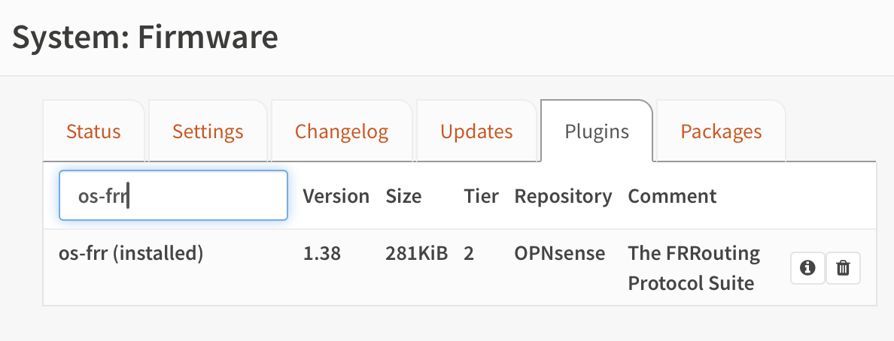
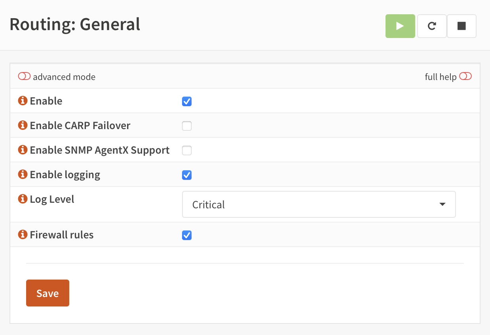
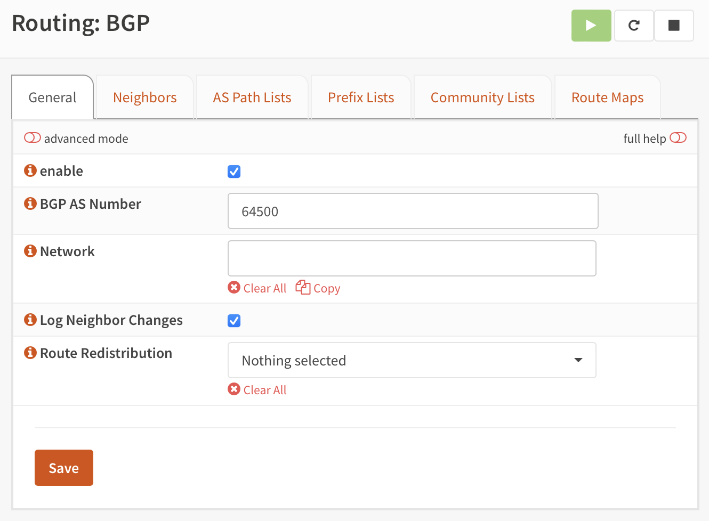

# Router BGP Configuration

Before I go too much further, I want to get load balancer services working.

With major cloud vendors that support Kubernetes, creating a service of type `LoadBalancer` will create a load balancer within that platform that provides external access to that service. This spares us from having to use ClusterIP, etc, to access our services.

This functionality isn't automatically available in a homelab. Why would it be? How could it know what you want? Regardless of the complexities preventing this from Just Working™, this topic is often a source of irritation to the homelabber.

Fortunately, a gentleman and scholar named Dave Anderson spent (I assume) a significant amount of time and devised a system, MetalLB, to bring load balancer functionality to bare metal clusters.

With a reasonable amount of effort, we can configure a router supporting BGP and a Kubernetes cluster running MetalLB into a pretty clean network infrastructure.

In my case, this starts with configuring my router/firewall (running [OPNsense](https://opnsense.org)) to support BGP.

This means installing the `os-frr` (for "Free-Range Routing") plugin:

Then we enable routing:

Then we enable BGP. We give the router an AS number of 64500.

Then we add each of the nodes that might run MetalLB "speakers" as neighbors. They all will share a single AS number, 64501.

In the next section, we'll configure MetalLB.
