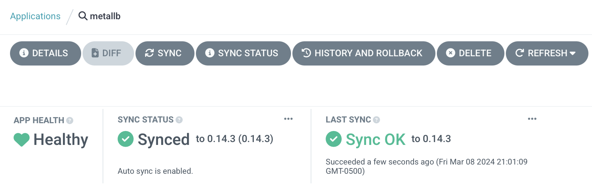

# MetalLB

MetalLB requires that its namespace have some extra privileges:

```yaml
  apiVersion: 'v1'
  kind: 'Namespace'
  metadata:
    name: 'metallb'
    labels:
      name: 'metallb'
      managed-by: 'argocd'
      pod-security.kubernetes.io/enforce: privileged
      pod-security.kubernetes.io/audit: privileged
      pod-security.kubernetes.io/warn: privileged
```

Its application is (perhaps surprisingly) rather simple to configure:

```yaml
apiVersion: 'argoproj.io/v1alpha1'
kind: 'Application'
metadata:
  name: 'metallb'
  namespace: 'argocd'
  labels:
    name: 'metallb'
    managed-by: 'argocd'
spec:
  project: 'metallb'
  source:
    repoURL: 'https://metallb.github.io/metallb'
    chart: 'metallb'
    targetRevision: '0.14.3'
    helm:
      releaseName: 'metallb'
      valuesObject:
        rbac:
          create: true
        prometheus:
          scrapeAnnotations: true
          metricsPort: 7472
          rbacPrometheus: true
  destination:
    server: 'https://kubernetes.default.svc'
    namespace: 'metallb'
  syncPolicy:
    automated:
      prune: true
      selfHeal: true
    syncOptions:
      - Validate=true
      - CreateNamespace=false
      - PrunePropagationPolicy=foreground
      - PruneLast=true
      - RespectIgnoreDifferences=true
      - ApplyOutOfSyncOnly=true
```

It does require some extra resources, though. The first of these is an address pool from which to allocate IP addresses. It's important that this not overlap with a DHCP pool.

The full network is 10.4.0.0/20 and I've configured the DHCP server to only serve addresses in 10.4.0.100-254, so we have plenty of space to play with. Right now, I'll use 10.4.11.0-10.4.15.254, which gives ~1250 usable addresses. I don't think I'll use quite that many.

```yaml
apiVersion: 'metallb.io/v1beta1'
kind: 'IPAddressPool'
metadata:
  name: 'primary'
  namespace: 'metallb'
spec:
  addresses:
  - 10.4.11.0 - 10.4.15.254
```

Then we need to configure MetalLB to act as a BGP peer:

```yaml
apiVersion: 'metallb.io/v1beta2'
kind: 'BGPPeer'
metadata:
  name: 'marbrand'
  namespace: 'metallb'
spec:
  myASN: 64501
  peerASN: 64500
  peerAddress: 10.4.0.1
```

And advertise the IP address pool:

```yaml
apiVersion: 'metallb.io/v1beta1'
kind: 'BGPAdvertisement'
metadata:
  name: 'primary'
  namespace: 'metallb'
spec:
  ipAddressPools:
    - 'primary'
```

That's that; we can deploy it, and soon we'll be up and running, although we can't yet test it.


