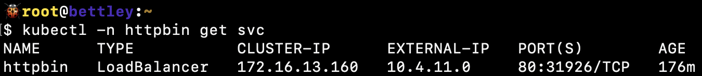

# Testing MetalLB

The simplest way to test MetalLB is just to deploy an application with a `LoadBalancer` service and see if it works.

I'm a fan of `httpbin` and its Go port, [`httpbingo`](https://httpbingo.org), so up it goes:

```yaml
apiVersion: 'argoproj.io/v1alpha1'
kind: 'Application'
metadata:
  name: 'httpbin'
  namespace: 'argocd'
  labels:
    name: 'httpbin'
    managed-by: 'argocd'
spec:
  project: 'httpbin'
  source:
    repoURL: 'https://matheusfm.dev/charts'
    chart: 'httpbin'
    targetRevision: '0.1.1'
    helm:
      releaseName: 'httpbin'
      valuesObject:
        service:
          type: 'LoadBalancer'
  destination:
    server: 'https://kubernetes.default.svc'
    namespace: 'httpbin'
  syncPolicy:
    automated:
      prune: true
      selfHeal: true
    syncOptions:
      - Validate=true
      - CreateNamespace=true
      - PrunePropagationPolicy=foreground
      - PruneLast=true
      - RespectIgnoreDifferences=true
      - ApplyOutOfSyncOnly=true
```

Very quickly, it's synced:


We can get the IP address allocated for the load balancer with `kubectl -n httpbin get svc`:



And sure enough, it's allocated from the IP address pool we specified. That seems like an excellent sign!

Can we access it from a web browser running on a computer on a different network?


Yes, we can! Our load balancer system is working!
