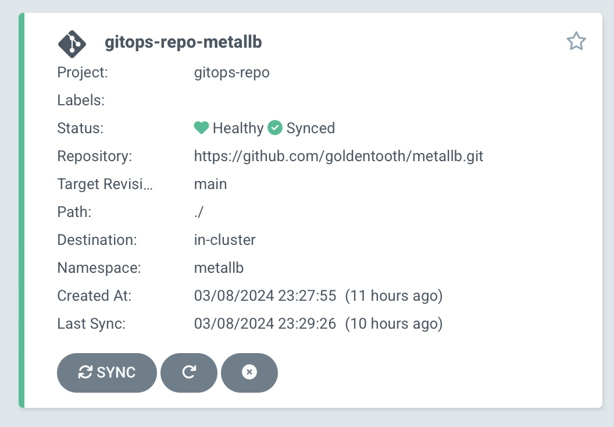
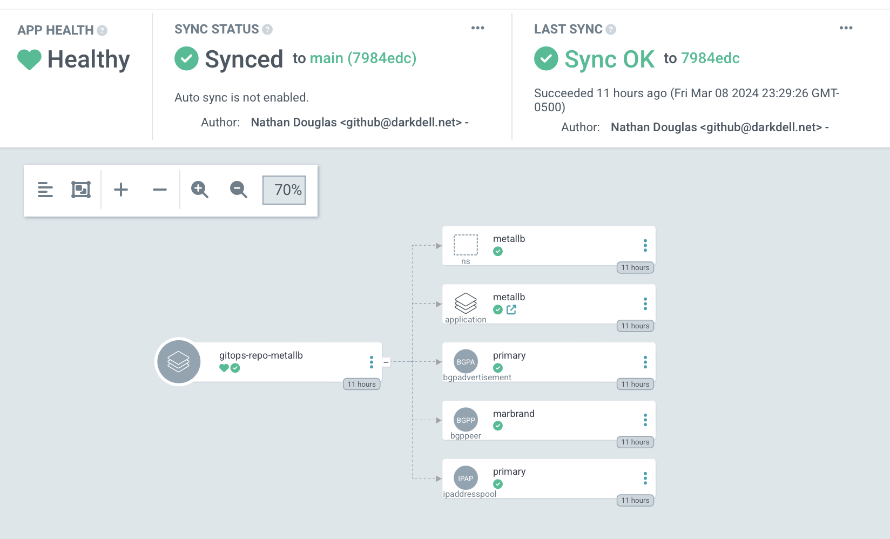
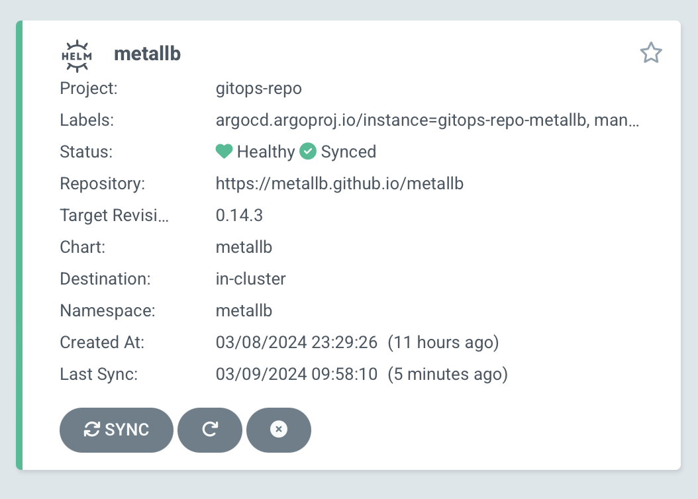
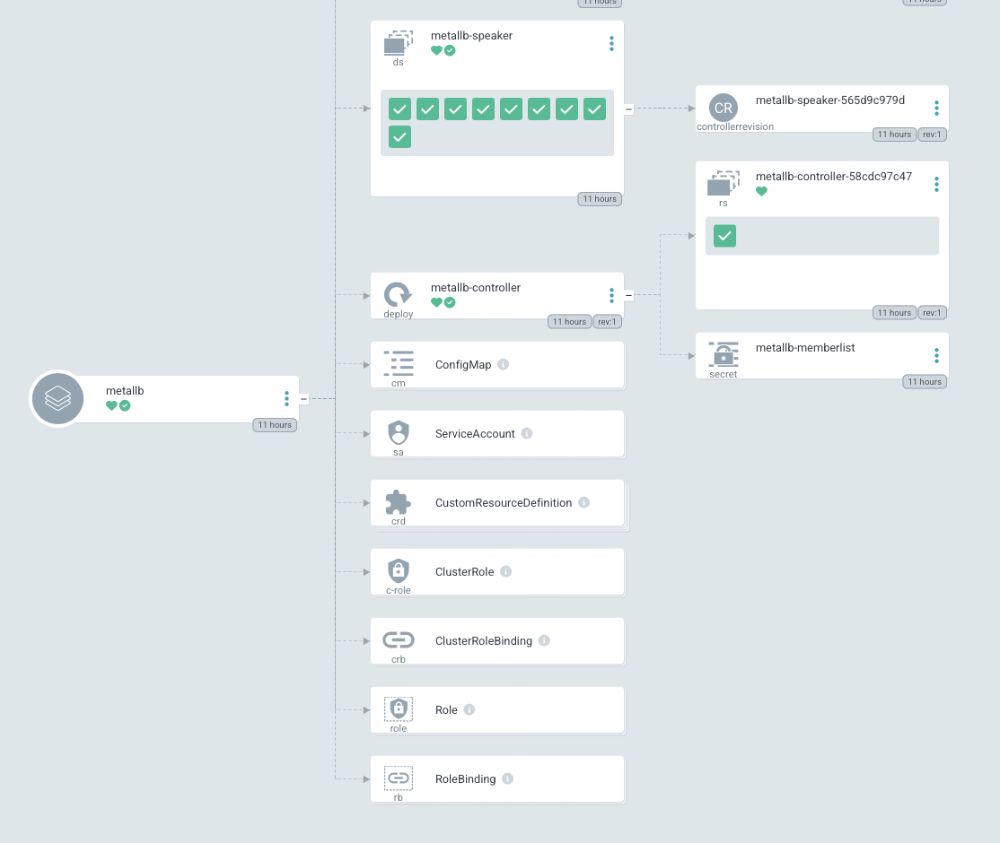

# Refactoring Argo CD

We're only a few projects in, and using Ansible to install our Argo CD applications seems a bit weak. It's not very GitOps-y to run a Bash command that runs an Ansible playbook that `kubectl`s some manifests into our Kubernetes cluster.

In fact, the less we mess with Argo CD itself, the better. Eventually, we'll be able to create a repository on GitHub and see resources appear within our Kubernetes cluster without having to touch Argo CD at all!

We'll do this by using the power of `ApplicationSet` resources.

First, we'll create a secret to hold a GitHub token. This part is optional, but it'll allow us to use the API more.

Second, we'll create an `AppProject` to encompass these applications. It'll have pretty broad permissions at first, though I'll try and tighten them up a bit.

```yaml
apiVersion: 'argoproj.io/v1alpha1'
kind: 'AppProject'
metadata:
  name: 'gitops-repo'
  namespace: 'argocd'
  finalizers:
    - 'resources-finalizer.argocd.argoproj.io'
spec:
  description: 'GoldenTooth GitOps-Repo project'
  sourceRepos:
    - '*'
  destinations:
    - namespace: '!kube-system'
      server: '*'
    - namespace: '*'
      server: '*'
  clusterResourceWhitelist:
    - group: '*'
      kind: '*'
```

Then an `ApplicationSet`.

```yaml
apiVersion: 'argoproj.io/v1alpha1'
kind: 'ApplicationSet'
metadata:
  name: 'gitops-repo'
  namespace: 'argocd'
spec:
  generators:
    - scmProvider:
        github:
          organization: 'goldentooth'
          tokenRef:
            secretName: 'github-token'
            key: 'token'
        filters:
          - labelMatch: 'gitops-repo'
  template:
    goTemplate: true
    goTemplateOptions: ["missingkey=error"]
    metadata:
      # Prefix name with `gitops-repo-`.
      # This allows us to define the `Application` manifest within the repo and
      # have significantly greater flexibility, at the cost of an additional
      # application in the Argo CD UI.
      name: 'gitops-repo-{{ .repository }}'
    spec:
      source:
        repoURL: '{{ .url }}'
        targetRevision: '{{ .branch }}'
        path: './'
      project: 'gitops-repo'
      destination:
        server: https://kubernetes.default.svc
        namespace: '{{ .repository }}'
```

The idea is that I'll create a repository and give it a topic of `gitops-repo`. This will be matched by the `labelMatch` `filter`, and then Argo CD will deploy whatever manifests it finds there.

MetalLB is the natural place to start.

We don't actually have to do that much to get this working:

1. Create a new repository [`metallb`](https://github.com/goldentooth/metallb).
2. Add a [`Chart.yaml`](https://github.com/goldentooth/metallb/blob/main/Chart.yaml) file with some boilerplate.
3. Add the manifests to a [`templates/`](https://github.com/goldentooth/metallb/tree/main/templates) directory.
4. Add a [`values.yaml`](https://github.com/goldentooth/metallb/blob/main/values.yaml) file with values to substitute into the manifests.
5. As mentioned above, edit the repo to give it the `gitops-repo` topic.

Within a few minutes, Argo CD will notice the changes and deploy a `gitops-repo-metallb` application:



If we click into it, we'll see the resources deployed by the manifests within the repository:



So we see the resources we created previously for the BGPPeer, IPAddressPool, and BGPAdvertisement. We also see an Application, `metallb`, which we can also see in the general Applications overview in Argo CD:



Clicking into it, we'll see all of the resources deployed by the `metallb` Helm chart we referenced.



A quick test to verify that our `httpbin` application is still assigned a working load balancer, and we can declare victory!

While I'm here, I might as well shift `httpbin` and `prometheus-node-exporter` as well...
